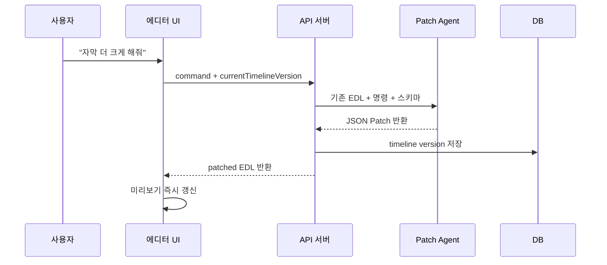
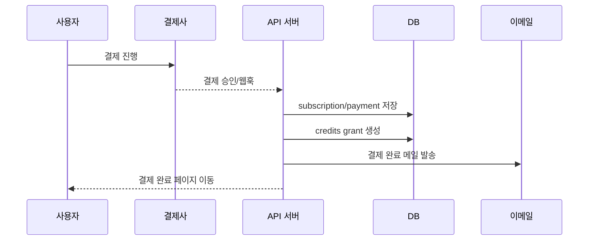
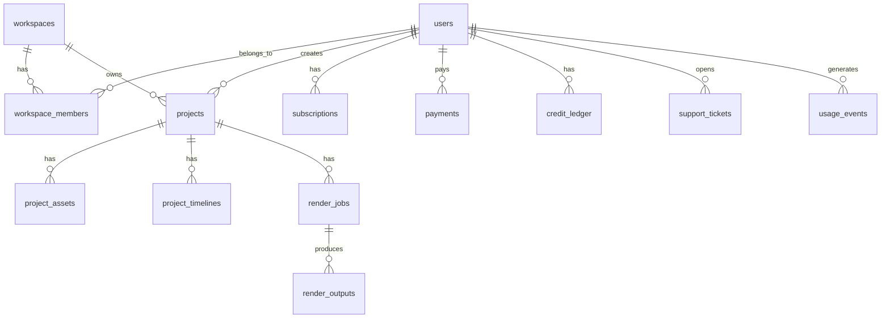

# AI 영상 자동편집 SaaS 운영·제품 구축 큰그림 문서

> 목적: Cursor AI에게 전달하여, 기술 엔진(영상 분석·타임라인 생성·렌더링) 외에 **서비스를 실제로 판매·운영하기 위해 필요한 페이지, 결제, 회원, 권한, 관리자, CS, 약관, 요금제, 운영 지표**를 한 번에 설계하기 위한 문서이다.  
> 대상 서비스: 사용자가 영상 제목, 영상 설명, 원본 영상들, 원하는 편집 스타일을 입력하면 AI가 자동으로 편집하고 실시간 미리보기 후 MP4로 렌더링하는 웹 기반 SaaS.

---

## 0. 핵심 결론

이 서비스는 단순한 “영상편집 툴”이 아니라 다음 3개 시스템이 결합된 SaaS로 봐야 한다.

```text
1. 마케팅/가입/결제 시스템
   - 메인페이지
   - 가격 페이지
   - 회원가입/로그인
   - 무료 체험/크레딧 지급
   - 구독/결제/환불/영수증

2. 영상 제작 워크스페이스 시스템
   - 프로젝트 대시보드
   - 영상 업로드
   - AI 편집 요청 페이지
   - 실시간 미리보기 에디터
   - 렌더링 진행/완료 페이지
   - 다운로드/공유/재편집

3. 운영/관리 시스템
   - 관리자 대시보드
   - 사용자/결제/사용량 관리
   - 렌더링 실패 관리
   - CS/문의/환불 처리
   - 공지/장애/이벤트 관리
   - 약관/개인정보/콘텐츠 정책
```

MVP에서는 모든 기능을 완벽하게 만들 필요가 없다. **가입 → 무료 크레딧 → 영상 업로드 → AI 편집 → 프리뷰 → 렌더링 → 크레딧 차감 → 결제 전환** 흐름만 완성하면 된다.

---

## 1. 추천 포지셔닝

### 1.1 일반 포지셔닝

```text
AI가 알아서 컷 편집, 자막, 스타일, BGM, 화면 전환까지 만들어주는 자동 영상편집 서비스
```

### 1.2 더 강한 포지셔닝

노바AI/교육 시장과 결합한다면 아래 포지셔닝이 더 강하다.

```text
강의 영상·문제 해설·수업 자료를 넣으면 AI가 자동으로 쇼츠/릴스/강의 클립을 만들어주는 교육용 AI 영상 제작 서비스
```

### 1.3 초기 타깃

| 타깃 | 문제 | 구매 이유 | 추천 랜딩 카피 |
|---|---|---|---|
| 학원 선생님 | 강의 홍보 쇼츠 제작 시간이 오래 걸림 | 강의 영상만 올리면 홍보 쇼츠 생성 | “강의 영상 하나로 쇼츠 10개 자동 생성” |
| 온라인 강사 | 긴 강의에서 핵심 클립을 뽑기 어려움 | 하이라이트 자동 추출 | “긴 강의에서 핵심 장면만 AI가 찾아드립니다” |
| 에듀테크/출판사 | 문제 해설 콘텐츠 제작 비용이 높음 | 문제·PDF 기반 해설 영상 자동 제작 | “문제 하나로 해설 영상까지 자동 생성” |
| 1인 크리에이터 | 편집 인력이 없음 | 자막/컷/스타일 자동화 | “영상만 올리면 편집본이 완성됩니다” |
| 마케팅팀 | 제품 소개 영상 반복 제작 | 템플릿 기반 대량 제작 | “제품 소개 영상을 템플릿으로 자동 생산” |

초기에는 **학원 선생님/강의 콘텐츠 제작자**를 1순위로 잡는 것을 권장한다. 일반 영상편집 시장은 CapCut, Descript, Runway, Canva 등과 직접 경쟁하게 되지만, 교육 콘텐츠 자동 제작은 노바AI의 기존 고객층과 연결된다.

---

## 2. 전체 서비스 페이지 구조

```mermaid
flowchart TD
    A[비로그인 영역] --> A1[메인페이지]
    A --> A2[가격 페이지]
    A --> A3[기능 소개 페이지]
    A --> A4[템플릿/예시 페이지]
    A --> A5[고객 사례 페이지]
    A --> A6[FAQ/고객센터]
    A --> A7[로그인/회원가입]

    B[로그인 후 앱 영역] --> B1[온보딩]
    B --> B2[프로젝트 대시보드]
    B --> B3[새 영상 만들기]
    B --> B4[업로드/소스 관리]
    B --> B5[AI 편집 요청]
    B --> B6[실시간 미리보기 에디터]
    B --> B7[렌더링 진행 페이지]
    B --> B8[결과물/다운로드 페이지]
    B --> B9[사용량/크레딧 페이지]
    B --> B10[결제/요금제 관리]
    B --> B11[계정/팀 설정]

    C[운영자 영역] --> C1[관리자 대시보드]
    C --> C2[사용자 관리]
    C --> C3[결제/구독 관리]
    C --> C4[크레딧/사용량 관리]
    C --> C5[렌더링 작업 관리]
    C --> C6[실패/장애 모니터링]
    C --> C7[문의/환불/CS]
    C --> C8[공지/이벤트/쿠폰]
    C --> C9[템플릿/스타일 프리셋 관리]
```



---

## 3. 페이지별 큰그림

## 3.1 메인페이지 `/`

### 목적

방문자에게 “이 서비스가 뭘 해주는지”를 5초 안에 이해시키고, 회원가입 또는 무료 체험으로 전환시킨다.

### 핵심 메시지

```text
영상 제목과 원본 영상만 넣으면 AI가 자동으로 컷편집, 자막, 스타일링, 쇼츠 변환까지 해드립니다.
```

교육 시장 타깃이면:

```text
강의 영상을 올리면 AI가 핵심 장면을 찾아 쇼츠와 해설 클립으로 자동 편집합니다.
```

### 필수 섹션

1. Hero
   - 한 줄 가치 제안
   - CTA: “무료로 영상 만들어보기”
   - 짧은 데모 영상 또는 전후 비교

2. Before/After
   - 원본 긴 영상
   - AI 편집 결과 쇼츠
   - 자동 자막/줌인/컷전환/강조 표시

3. 사용 방법 3단계
   - 영상 업로드
   - 제목/내용/스타일 입력
   - AI 편집본 확인 및 다운로드

4. 대표 사용 사례
   - 강의 쇼츠
   - 제품 소개 영상
   - 인터뷰 클립
   - 문제 해설 영상
   - SNS 릴스

5. 요금제 요약
   - 무료 체험 제공
   - 월 구독/크레딧 충전
   - CTA: “요금제 보기”

6. 신뢰 요소
   - 처리 가능한 형식
   - 개인정보/업로드 파일 보호 안내
   - 렌더링 실패 시 크레딧 복구 정책

7. FAQ
   - CapCut과 차이점
   - 무료로 몇 개 만들 수 있는지
   - 워터마크 여부
   - 상업적 사용 가능 여부
   - 환불 정책

### 주요 CTA

| 위치 | CTA |
|---|---|
| Hero | 무료로 영상 만들기 |
| Before/After | 내 영상으로 테스트하기 |
| 가격 섹션 | 요금제 보기 |
| 하단 | 지금 시작하기 |

---

## 3.2 가격 페이지 `/pricing`

### 목적

무료 사용자를 유료 결제로 전환한다.

AI 영상 서비스는 비용 구조가 “렌더링 시간, 원본 영상 길이, AI 분석 비용, 저장 용량, 생성형 영상 사용량”에 따라 증가한다. 따라서 단순 월정액 무제한은 위험하다. **월 구독 + 크레딧 차감제**가 가장 적합하다.

### 경쟁 서비스에서 참고할 가격 구조

- Descript는 Free, Hobbyist, Creator, Business, Enterprise 형태로 플랜을 나누며, 미디어 시간과 AI 크레딧을 플랜별로 제한한다.
- Runway는 Free, Standard, Pro, Max, Enterprise 형태로 플랜을 나누며, 크레딧과 저장 용량, 워터마크 제거, 모델 접근 권한을 차등화한다.
- Stripe Billing은 사용량 기반 과금, 선불 크레딧, 복합 가격, 실시간 사용량 가시성 같은 SaaS 과금 구조를 지원한다.

### 추천 가격 구조

#### MVP 1차 가격안

| 플랜 | 월 가격 | 포함 크레딧 | 적합 고객 | 제한 |
|---|---:|---:|---|---|
| Free | 0원 | 300 크레딧 최초 1회 | 체험 사용자 | 워터마크, 낮은 우선순위, 최대 1분 결과물 |
| Starter | 19,900원/월 | 2,000 크레딧/월 | 개인 크리에이터 | 720p/1080p, 월 20개 내외 쇼츠 |
| Pro | 49,900원/월 | 7,000 크레딧/월 | 강사/학원/마케터 | 1080p, 워터마크 없음, 빠른 렌더링 |
| Business | 149,000원/월 | 25,000 크레딧/월 | 학원/팀 | 팀원 3명, 브랜드 프리셋, 우선 렌더링 |
| Enterprise | 문의 | 맞춤 | 출판사/대형 학원 | SLA, 대량 렌더링, 전담 지원 |

#### 크레딧 차감 예시

| 작업 | 차감 방식 | 예시 |
|---|---|---|
| 음성 인식/STT | 원본 영상 분 단위 | 10분 영상 = 100 크레딧 |
| AI 하이라이트 분석 | 원본 영상 분 단위 | 10분 영상 = 150 크레딧 |
| AI 타임라인 생성 | 요청 1회 | 50~100 크레딧 |
| 720p 렌더링 | 결과물 분 단위 | 1분 결과물 = 100 크레딧 |
| 1080p 렌더링 | 결과물 분 단위 | 1분 결과물 = 200 크레딧 |
| 4K 렌더링 | 결과물 분 단위 | 1분 결과물 = 500 크레딧 |
| 생성형 B-roll | 생성 초 단위 | 5초 = 300~1,000 크레딧 |
| TTS 음성 생성 | 글자/초 단위 | 1분 내레이션 = 50~150 크레딧 |

### 가격 페이지 구성

1. 월간/연간 토글
   - 연간 결제 시 2개월 무료 또는 20% 할인

2. 플랜 카드
   - Free / Starter / Pro / Business
   - 가장 추천 플랜은 Pro

3. 플랜별 기능 비교표
   - 포함 크레딧
   - 최대 업로드 길이
   - 최대 결과물 길이
   - 워터마크 여부
   - 출력 해상도
   - 동시 렌더링 수
   - 팀원 수
   - 브랜드 프리셋 수
   - 고객 지원 우선순위

4. 크레딧 계산 예시
   - “10분 강의 영상 1개 → 쇼츠 5개 생성 시 예상 크레딧”

5. 초과 사용/충전 안내
   - 크레딧 부족 시 추가 충전
   - 충전 크레딧은 6개월 또는 1년 유효기간

6. FAQ
   - 크레딧은 언제 차감되는가?
   - 렌더링 실패 시 크레딧이 복구되는가?
   - 구독 취소 시 남은 크레딧은 어떻게 되는가?
   - 환불은 어떻게 처리되는가?

### 가격 정책 원칙

```text
1. 무료 사용자는 반드시 결과를 경험하게 한다.
2. 무료 사용자는 워터마크 또는 저해상도로 제한한다.
3. 유료 사용자는 속도, 해상도, 워터마크 제거, 더 긴 영상으로 업그레이드하게 한다.
4. AI 생성형 영상 기능은 별도 고비용 기능으로 취급한다.
5. 무제한이라는 표현은 피한다.
6. 렌더링 실패/시스템 오류는 크레딧 자동 복구한다.
```

---

## 3.3 회원가입 페이지 `/signup`

### 목적

최대한 낮은 마찰로 사용자가 첫 프로젝트를 생성하게 한다.

### 추천 가입 방식

MVP 기준으로는 다음 순서가 좋다.

```text
1순위: 구글 로그인
2순위: 카카오 로그인
3순위: 이메일/비밀번호
4순위: 매직링크
```

교육/학원 고객이 많다면 카카오 로그인은 전환율에 유리하다. 다만 초기 개발 속도는 Supabase Auth 또는 Clerk 기반의 Google OAuth가 빠르다.

### 필수 입력값

가입 시 처음부터 많은 정보를 요구하지 않는다.

| 단계 | 입력값 |
|---|---|
| 회원가입 시 | 이메일, 이름, 로그인 제공자 |
| 온보딩 시 | 사용 목적, 직업, 만들고 싶은 영상 유형 |
| 결제 시 | 결제자명, 연락처, 사업자/현금영수증 정보 선택 |

### 가입 후 무료 크레딧

```text
신규 가입자에게 300~500 크레딧 지급
단, 전화번호 인증 또는 이메일 인증 완료 시 지급
```

무료 크레딧은 반드시 “첫 성공 경험”을 만들 수 있어야 한다. 예를 들어 1분 이하 쇼츠 1개를 만들 수 있는 수준이어야 한다.

### 가입 완료 후 이동

```text
/signup → /onboarding → /dashboard?welcome=true
```

---

## 3.4 로그인 페이지 `/login`

### 목적

기존 사용자가 빠르게 워크스페이스로 돌아오게 한다.

### 필수 요소

- 구글 로그인
- 카카오 로그인
- 이메일 로그인
- 비밀번호 찾기
- 약관/개인정보 링크
- 로그인 문제 문의 링크

### 예외 처리

| 상황 | 처리 |
|---|---|
| 비밀번호 오류 | 5회 이상 실패 시 rate limit |
| 가입되지 않은 이메일 | 회원가입 유도 |
| OAuth 이메일 중복 | 기존 계정과 연결 처리 |
| 탈퇴 계정 | 복구 가능 기간 안내 |

---

## 3.5 온보딩 페이지 `/onboarding`

### 목적

사용자의 목적을 파악하여 첫 프로젝트 생성을 쉽게 만든다.

### 질문 구성

1. 어떤 영상을 만들고 싶나요?
   - 쇼츠/릴스
   - 유튜브 영상
   - 강의 클립
   - 문제 해설 영상
   - 제품 소개 영상
   - 인터뷰 클립

2. 어떤 스타일을 원하시나요?
   - 빠른 쇼츠 스타일
   - 깔끔한 토스 스타일
   - 교육용 차분한 스타일
   - 자막 강조형
   - 강의/칠판 스타일

3. 주로 어떤 일을 하시나요?
   - 학원 선생님
   - 온라인 강사
   - 크리에이터
   - 마케터
   - 출판사/교육기업
   - 기타

4. 첫 영상을 바로 만들어볼까요?
   - 영상 업로드하기
   - 예제 영상으로 체험하기

### 온보딩 결과 저장

```ts
interface UserOnboardingProfile {
  userId: string;
  primaryUseCase: 'shorts' | 'lecture_clip' | 'education_explainer' | 'marketing' | 'interview';
  role: 'teacher' | 'creator' | 'marketer' | 'publisher' | 'other';
  preferredStyle: string;
  defaultAspectRatio: '9:16' | '16:9' | '1:1';
  completedAt: string;
}
```

---

## 3.6 프로젝트 대시보드 `/dashboard`

### 목적

사용자가 만든 영상 프로젝트를 관리하고 새 영상을 만들게 한다.

### 필수 구성

1. 상단 요약 카드
   - 남은 크레딧
   - 이번 달 사용량
   - 현재 플랜
   - 렌더링 중 작업 수

2. CTA
   - “새 영상 만들기”
   - “강의 영상으로 쇼츠 만들기”
   - “문제 해설 영상 만들기”

3. 프로젝트 목록
   - 썸네일
   - 제목
   - 상태
   - 생성일
   - 길이
   - 사용 크레딧
   - 다운로드/복제/삭제

4. 상태 필터
   - 전체
   - 편집 중
   - 렌더링 중
   - 완료
   - 실패

### 프로젝트 상태

```ts
export type ProjectStatus =
  | 'draft'
  | 'uploading'
  | 'analyzing'
  | 'timeline_ready'
  | 'previewing'
  | 'render_queued'
  | 'rendering'
  | 'completed'
  | 'failed'
  | 'archived';
```

### 대시보드 운영 포인트

- 사용자가 결과물을 잊지 않도록 “렌더링 완료” 이메일/알림을 보낸다.
- 실패 프로젝트는 “재시도” 버튼을 제공한다.
- 크레딧 부족 시 업그레이드 배너를 노출한다.
- 프로젝트 복제 기능은 재구매/반복 사용을 유도한다.

---

## 3.7 새 영상 만들기 `/projects/new`

### 목적

사용자가 원본 영상과 편집 의도를 입력하여 AI 편집 작업을 시작하게 한다.

### 입력 필드

| 필드 | 설명 | 필수 여부 |
|---|---|---|
| 영상 제목 | 결과물 제목/주제 | 필수 |
| 영상 설명 | 어떤 내용으로 편집할지 | 필수 |
| 원본 영상 업로드 | 하나 이상 | 필수 |
| 원하는 결과물 길이 | 15초, 30초, 60초, 직접 입력 | 필수 |
| 화면 비율 | 9:16, 16:9, 1:1 | 필수 |
| 편집 스타일 | 프리셋 선택 또는 자연어 입력 | 필수 |
| 참고 링크/스크립트 | 선택 | 선택 |
| BGM 사용 여부 | 선택 | 선택 |
| 자막 스타일 | 선택 | 선택 |

### 업로드 제한 예시

| 플랜 | 최대 원본 길이 | 최대 파일 크기 | 동시 업로드 |
|---|---:|---:|---:|
| Free | 3분 | 500MB | 1개 |
| Starter | 30분 | 2GB | 3개 |
| Pro | 2시간 | 10GB | 10개 |
| Business | 5시간 | 30GB | 30개 |

### UX 원칙

- 업로드 중에도 제목/스타일 입력을 먼저 받을 수 있게 한다.
- 대용량 파일 업로드는 중단/재개가 가능해야 한다.
- 업로드 완료 후 즉시 프록시 생성/분석 작업 상태를 보여준다.
- 사용자는 “분석 완료까지 기다리는 화면”에서 이탈하지 않도록 예시 결과/활용 팁을 보여준다.

---

## 3.8 AI 편집 요청 페이지 `/projects/[id]/brief`

### 목적

AI가 편집할 방향을 명확히 입력받는다.

### 편집 브리프 구조

```ts
interface EditBrief {
  projectId: string;
  title: string;
  contentDescription: string;
  targetAudience: string;
  platform: 'youtube_shorts' | 'instagram_reels' | 'tiktok' | 'youtube_long' | 'lecture';
  aspectRatio: '9:16' | '16:9' | '1:1';
  targetDurationSec: number;
  stylePreset: string;
  customStylePrompt?: string;
  captionPreference: 'large' | 'minimal' | 'word_highlight' | 'education';
  bgmPreference: 'none' | 'calm' | 'energetic' | 'corporate';
  includeCTA: boolean;
}
```

### 스타일 프리셋 예시

| 프리셋 | 설명 |
|---|---|
| 빠른 쇼츠 스타일 | 빠른 컷, 큰 자막, 강한 후킹 |
| 깔끔한 토스 스타일 | 흰 배경, 여백, 큰 타이포, 부드러운 모션 |
| 교육용 해설 스타일 | 차분한 자막, 핵심 개념 강조, 도식 삽입 |
| 강의 클립 스타일 | 강사 얼굴/칠판 중심, 핵심 발언만 추출 |
| 제품 소개 스타일 | 기능 중심, 장점 강조, CTA 포함 |

---

## 3.9 실시간 미리보기 에디터 `/projects/[id]/editor`

### 목적

AI 편집 결과를 사용자가 확인하고 자연어로 수정하게 한다.

### 화면 구성

```text
좌측: 프로젝트/소스/AI 브리프 패널
중앙: 실시간 미리보기 플레이어
우측: AI 수정 채팅창 + 스타일 패널
하단: 간단 타임라인
```

### MVP에서 필요한 기능

| 기능 | MVP 포함 여부 |
|---|---|
| 미리보기 재생 | 필수 |
| 컷 순서 확인 | 필수 |
| 자막 확인 | 필수 |
| 자연어 수정 | 필수 |
| 자막 스타일 변경 | 필수 |
| 인트로 삭제/길이 조절 | 필수 |
| BGM 볼륨 조절 | 선택 |
| 전문 타임라인 수동 편집 | 후순위 |
| 키프레임 편집 | 후순위 |
| 다중 트랙 수동 편집 | 후순위 |

### 자연어 수정 명령 예시

```text
자막을 더 크게 해줘
인트로 2초 줄여줘
말이 없는 부분은 다 잘라줘
더 빠른 쇼츠 느낌으로 바꿔줘
문제 이미지를 더 크게 보여줘
마지막에 구독 유도 문구를 넣어줘
BGM 소리를 줄여줘
중요한 공식이 나올 때 화면을 확대해줘
```

### 수정 처리 구조



---

## 3.10 렌더링 진행 페이지 `/projects/[id]/rendering`

### 목적

최종 MP4 생성 과정을 투명하게 보여주고 이탈을 줄인다.

### 표시 정보

- 현재 단계
  - 대기 중
  - 렌더링 준비
  - 프레임 렌더링
  - 오디오 합성
  - 자막 합성
  - 인코딩
  - 업로드
  - 완료

- 예상 진행률
- 예상 소요 시간
- 사용 크레딧
- 실패 시 재시도 버튼

### 운영 원칙

```text
렌더링 요청 시점에 크레딧을 임시 차감한다.
렌더링 성공 시 확정 차감한다.
렌더링 실패 시 자동 복구한다.
사용자 취소 시 진행 단계에 따라 일부 차감 또는 전액 복구 정책을 둔다.
```

---

## 3.11 결과물 페이지 `/projects/[id]/result`

### 목적

완성된 결과물을 다운로드하고, 재편집/복제/공유하게 한다.

### 필수 기능

- MP4 다운로드
- 썸네일 다운로드
- SRT 자막 다운로드
- 프로젝트 복제
- 다시 편집하기
- 다른 비율로 재생성하기
- 공유 링크 생성
- 결과물 만족도 평가

### 업셀 포인트

| 상황 | 업셀 메시지 |
|---|---|
| Free 사용자가 다운로드 | 워터마크 제거하려면 Pro로 업그레이드 |
| 720p 출력 후 | 1080p/4K 출력은 Pro 이상에서 가능 |
| 크레딧 부족 | 추가 크레딧 충전 |
| 여러 비율 생성 | Pro에서 9:16/16:9/1:1 동시 생성 가능 |

---

## 3.12 결제 페이지 `/billing/checkout`

### 목적

사용자가 선택한 플랜 또는 크레딧 충전을 결제한다.

### 국내 서비스 기준 PG 선택

| 선택지 | 장점 | 단점 | 추천 상황 |
|---|---|---|---|
| 토스페이먼츠 | 국내 카드/계좌 결제 UX 좋음, 문서 좋음 | 구독 자동결제는 직접 스케줄링 필요, 계약/심사 필요 | 한국 고객 중심 SaaS |
| PortOne | 여러 PG 통합에 유리 | PG별 정책 이해 필요 | 다양한 PG를 붙일 때 |
| Stripe | 글로벌 SaaS 구독/포털/청구서/미터링 강함 | 한국 내 사업자/결제수단 이슈 확인 필요 | 글로벌 결제/해외 고객 |
| Paddle | 글로벌 Merchant of Record | 국내 결제 UX 약함 | 해외 SaaS 판매 |

MVP가 한국 학원/강사 대상이면 **토스페이먼츠 + 자체 구독 스케줄러**가 현실적이다. 해외 확장 또는 글로벌 SaaS형이면 Stripe Billing도 병행 검토한다.

### 결제 방식

1. 월 구독 결제
   - 매월 자동결제
   - 플랜별 크레딧 지급

2. 연간 결제
   - 12개월치 크레딧 선지급 또는 월별 지급 중 선택
   - 초기에는 월별 지급을 추천한다. 선지급은 환불/남용 리스크가 크다.

3. 크레딧 충전
   - 5,000 / 10,000 / 30,000 크레딧
   - 구독자 할인 가능

4. 기업 결제
   - 세금계산서/계좌이체/수동 입금
   - 관리자 수동 크레딧 지급

### 결제 성공 후 처리



---

## 3.13 요금제 관리 페이지 `/settings/billing`

### 목적

사용자가 자신의 구독, 결제수단, 영수증, 크레딧을 관리하게 한다.

### 필수 기능

- 현재 플랜 표시
- 다음 결제일
- 다음 지급 크레딧
- 남은 크레딧
- 결제수단 변경
- 플랜 업그레이드/다운그레이드
- 구독 취소
- 결제 내역
- 영수증/현금영수증/세금계산서 신청
- 크레딧 사용 내역

### 구독 취소 UX

취소 버튼만 두면 이탈이 커진다. 아래 순서로 취소 방어를 넣는다.

```text
1. 취소 사유 선택
2. 사용하지 않은 크레딧 안내
3. 더 낮은 요금제 제안
4. 일시정지 제안
5. 최종 취소 확인
```

---

## 3.14 사용량/크레딧 페이지 `/usage`

### 목적

사용자가 왜 크레딧이 차감됐는지 이해하게 한다.

### 필수 테이블

| 날짜 | 프로젝트 | 작업 | 사용량 | 차감 크레딧 | 상태 |
|---|---|---|---:|---:|---|
| 2026-06-25 | 강의 쇼츠 | STT 분석 | 10분 | 100 | 성공 |
| 2026-06-25 | 강의 쇼츠 | 1080p 렌더링 | 1분 | 200 | 성공 |
| 2026-06-25 | 제품 영상 | 렌더링 | 1분 | 0 | 실패/복구 |

### 크레딧 원장 구조

크레딧은 단순 숫자 컬럼으로만 관리하면 안 된다. 반드시 ledger 구조를 둔다.

```ts
interface CreditLedgerEntry {
  id: string;
  userId: string;
  workspaceId?: string;
  type: 'grant' | 'usage' | 'refund' | 'expire' | 'adjustment';
  amount: number; // 지급은 +, 차감은 -
  balanceAfter: number;
  reason: string;
  relatedProjectId?: string;
  relatedPaymentId?: string;
  createdAt: string;
}
```

---

## 3.15 계정 설정 `/settings/account`

### 필수 기능

- 이름 변경
- 이메일 변경
- 비밀번호 변경
- OAuth 연결 관리
- 알림 설정
- 계정 삭제
- 개인정보 다운로드 요청

### 계정 삭제 정책

```text
1. 삭제 요청
2. 7일 또는 14일 복구 가능 기간
3. 프로젝트/영상 파일 삭제 예약
4. 법정 보관이 필요한 결제/세금 정보는 별도 보관
5. 최종 삭제 완료 메일 발송
```

---

## 3.16 팀/워크스페이스 설정 `/settings/workspace`

### 목적

Business 이상에서 학원/팀 단위 사용을 가능하게 한다.

### 필수 기능

- 워크스페이스 이름
- 팀원 초대
- 역할 관리
- 브랜드 프리셋 관리
- 공용 템플릿 관리
- 팀 크레딧 공유

### 권한 구조

| 역할 | 권한 |
|---|---|
| Owner | 결제/팀원/삭제/전체 프로젝트 관리 |
| Admin | 팀원/프로젝트/템플릿 관리 |
| Editor | 프로젝트 생성/편집/렌더링 |
| Viewer | 결과물 보기/다운로드만 가능 |
| Billing Manager | 결제/영수증/세금계산서 관리 |

---

## 4. 관리자 페이지 큰그림

## 4.1 관리자 대시보드 `/admin`

### 주요 지표

| 카테고리 | 지표 |
|---|---|
| 매출 | MRR, ARR, 신규 결제, 해지, 환불, ARPU |
| 사용자 | 신규 가입자, 활성 사용자, 무료→유료 전환율 |
| 사용량 | 업로드 수, 분석 수, 렌더링 수, 평균 결과물 길이 |
| 비용 | AI 비용, 렌더링 비용, 스토리지 비용, 프로젝트당 원가 |
| 품질 | 렌더링 실패율, 평균 대기시간, 재시도율 |
| 전환 | 랜딩→가입, 가입→첫 업로드, 첫 업로드→첫 렌더, 첫 렌더→결제 |

### MVP 관리자 홈 카드

```text
오늘 가입자
오늘 결제액
오늘 렌더링 수
렌더링 실패 수
남은 큐 작업 수
고비용 사용자 TOP 10
크레딧 음수/이상 사용자
문의 미처리 건수
```

---

## 4.2 사용자 관리 `/admin/users`

### 기능

- 사용자 검색
- 가입일/마지막 접속일
- 현재 플랜
- 남은 크레딧
- 총 사용량
- 프로젝트 목록
- 결제 내역
- 크레딧 수동 지급/회수
- 계정 정지/복구
- 관리자 메모

### 주의

관리자 수동 조작은 반드시 audit log를 남긴다.

```ts
interface AdminAuditLog {
  id: string;
  adminUserId: string;
  action: string;
  targetType: 'user' | 'payment' | 'project' | 'credit' | 'render_job';
  targetId: string;
  before?: object;
  after?: object;
  reason?: string;
  createdAt: string;
}
```

---

## 4.3 결제/구독 관리 `/admin/billing`

### 기능

- 결제 내역 조회
- 구독 상태 조회
- 결제 실패 조회
- 환불 처리
- 수동 결제 등록
- 세금계산서/현금영수증 상태
- 쿠폰/프로모션 적용
- 플랜 수동 변경

### 결제 상태

```ts
export type PaymentStatus =
  | 'ready'
  | 'paid'
  | 'failed'
  | 'cancelled'
  | 'partial_refunded'
  | 'refunded';

export type SubscriptionStatus =
  | 'trialing'
  | 'active'
  | 'past_due'
  | 'paused'
  | 'cancel_scheduled'
  | 'cancelled';
```

---

## 4.4 렌더링 작업 관리 `/admin/render-jobs`

### 기능

- 작업 큐 상태 조회
- 작업 상세 로그
- 실패 원인
- 재시도
- 강제 취소
- 크레딧 복구
- 특정 사용자 작업 우선순위 조정

### 실패 유형

| 실패 유형 | 처리 |
|---|---|
| 원본 파일 손상 | 사용자에게 재업로드 요청 |
| STT 실패 | 재시도 또는 수동 분석 생략 |
| LLM JSON 오류 | 자동 재시도, 스키마 검증 강화 |
| 렌더링 타임아웃 | 워커 재시도, 해상도 낮춤 제안 |
| 스토리지 업로드 실패 | 자동 재시도 |
| 사용량 초과 | 결제/업그레이드 유도 |

---

## 4.5 CS/문의 관리 `/admin/support`

### 문의 유형

- 결제/환불
- 렌더링 실패
- 결과물 품질 불만
- 크레딧 차감 문의
- 업로드 오류
- 계정/로그인 문제
- 세금계산서/현금영수증
- 기능 요청

### CS 자동화

```text
렌더링 실패 문의 → 프로젝트 ID 자동 첨부
크레딧 문의 → ledger 내역 자동 첨부
결제 문의 → payment/subscription 내역 자동 첨부
품질 불만 → 원본/결과물/EDL 버전 자동 첨부
```

---

## 5. 데이터베이스 큰그림

### 5.1 핵심 테이블

```text
users
workspaces
workspace_members
plans
subscriptions
payments
credit_ledger
projects
project_assets
project_briefs
project_timelines
render_jobs
render_outputs
style_presets
templates
support_tickets
admin_audit_logs
usage_events
notification_events
coupons
referrals
```

### 5.2 간단 ERD



---

## 6. 운영 이벤트 설계

### 6.1 반드시 추적할 이벤트

```ts
export type AnalyticsEvent =
  | 'landing_viewed'
  | 'pricing_viewed'
  | 'signup_started'
  | 'signup_completed'
  | 'onboarding_completed'
  | 'project_created'
  | 'asset_uploaded'
  | 'analysis_started'
  | 'analysis_completed'
  | 'timeline_generated'
  | 'preview_opened'
  | 'edit_command_sent'
  | 'render_started'
  | 'render_completed'
  | 'render_failed'
  | 'download_clicked'
  | 'checkout_started'
  | 'payment_completed'
  | 'subscription_cancel_started'
  | 'subscription_cancelled';
```

### 6.2 전환 퍼널

```text
방문자
  ↓ landing_viewed
회원가입 시작
  ↓ signup_started
회원가입 완료
  ↓ signup_completed
첫 프로젝트 생성
  ↓ project_created
첫 업로드 완료
  ↓ asset_uploaded
첫 프리뷰 확인
  ↓ preview_opened
첫 렌더링 완료
  ↓ render_completed
첫 다운로드
  ↓ download_clicked
유료 결제
  ↓ payment_completed
반복 사용
```

### 6.3 핵심 KPI

| 단계 | KPI |
|---|---|
| 획득 | 방문자 수, 가입 전환율 |
| 활성화 | 가입 후 첫 업로드율, 첫 렌더링 완료율 |
| 결제 | 무료→유료 전환율, 결제 시작→완료율 |
| 유지 | 7일/30일 재방문율, 월 반복 렌더링 수 |
| 수익 | MRR, ARPU, LTV, 크레딧 충전 매출 |
| 비용 | 렌더링 1분당 원가, 사용자당 AI 비용 |
| 품질 | 렌더링 실패율, 평균 렌더링 대기시간 |

---

## 7. 이메일/알림 설계

### 7.1 트랜잭션 이메일

| 이벤트 | 이메일 |
|---|---|
| 회원가입 | 가입 환영/이메일 인증 |
| 첫 프로젝트 생성 | 첫 영상 제작 안내 |
| 렌더링 완료 | 다운로드 링크 발송 |
| 렌더링 실패 | 실패 안내 및 크레딧 복구 안내 |
| 결제 완료 | 결제 영수증 |
| 결제 실패 | 결제수단 확인 요청 |
| 구독 갱신 | 갱신 완료 안내 |
| 구독 취소 | 취소 확인 및 재활성화 링크 |
| 크레딧 부족 | 충전/업그레이드 안내 |

### 7.2 마케팅 이메일

| 시점 | 내용 |
|---|---|
| 가입 후 1일 | 첫 영상 만드는 법 |
| 가입 후 3일 | 인기 템플릿/스타일 소개 |
| 첫 렌더링 후 | 더 좋은 결과를 위한 팁 |
| 무료 크레딧 소진 | 요금제 추천 |
| 14일 미사용 | 복귀 유도 |

### 7.3 이메일 도구

- Resend: 개발자 친화적인 이메일 API, 도메인/로그/웹훅 기능 제공.
- Postmark/SendGrid/Mailgun도 대안.
- 한국 카카오 알림톡은 결제/렌더링 완료 알림에 유리하지만 초기에는 이메일로 충분하다.

---

## 8. 결제·환불·세금 정책

### 8.1 결제 정책

```text
- 월 구독은 결제 즉시 해당 월 크레딧 지급
- 연간 구독은 월별 크레딧 지급을 기본으로 권장
- 크레딧 충전 상품은 결제 즉시 지급
- 구독 해지 시 다음 결제일부터 갱신 중단
- 남은 월 구독 기간은 유지
```

### 8.2 환불 정책 초안

```text
1. 결제 후 크레딧 미사용 상태에서는 7일 이내 전액 환불 가능
2. 크레딧을 사용한 경우 사용량을 차감한 후 부분 환불 가능
3. 렌더링 실패, 시스템 오류로 차감된 크레딧은 자동 복구
4. 생성형 AI 결과물의 단순 불만족은 환불 대상이 아니라 재생성/크레딧 일부 보상 정책으로 처리
5. 기업/연간 계약은 별도 계약서 기준
```

### 8.3 세금/영수증

국내 PG 연동 시 고려할 항목:

- 카드 영수증
- 현금영수증
- 세금계산서
- 부가가치세 포함 가격 표기
- 부분 취소 시 VAT/공급가액 정합성
- 면세/과세 상품 구분 필요 여부

AI 영상편집 SaaS는 일반적으로 과세 서비스로 취급될 가능성이 높으나, 실제 업종/계약/출판·교육 상품 결합 여부에 따라 세무사 확인이 필요하다.

---

## 9. 권한·보안·정책

### 9.1 인증/권한

- 사용자는 `userId` 기준으로 모든 프로젝트 접근 권한을 검증한다.
- 팀 기능 도입 시 `workspaceId` + `role` 기준으로 접근을 제어한다.
- 관리자 API는 별도 admin role과 audit log가 필요하다.
- 업로드 파일 URL은 public URL보다 signed URL을 권장한다.

### 9.2 콘텐츠 정책

AI 영상편집 서비스는 사용자가 업로드하는 파일을 처리하므로 반드시 콘텐츠 정책이 필요하다.

금지 예시:

```text
- 타인의 저작권 영상을 무단 편집/재배포하는 행위
- 불법촬영물/성적 콘텐츠/아동 성착취물
- 명예훼손/사칭/딥페이크 악용
- 폭력적 선동/증오 콘텐츠
- 개인정보가 포함된 영상을 무단 처리하는 행위
```

### 9.3 개인정보 처리

- 업로드 영상은 사용자가 삭제할 수 있어야 한다.
- 원본/프록시/렌더링 결과물의 보관 기간을 명시한다.
- 무료 사용자의 파일은 7~30일 후 자동 삭제하는 정책을 둘 수 있다.
- 유료 사용자는 보관 기간을 플랜별로 차등화할 수 있다.

### 9.4 파일 보관 정책 예시

| 플랜 | 원본 보관 | 결과물 보관 |
|---|---:|---:|
| Free | 7일 | 7일 |
| Starter | 30일 | 90일 |
| Pro | 90일 | 180일 |
| Business | 180일 | 1년 |
| Enterprise | 계약 기준 | 계약 기준 |

---

## 10. 추천 기술 스택: 운영/서비스 영역

기술 엔진 영역이 아니라 서비스 운영 영역 기준이다.

| 영역 | 추천 | 이유 |
|---|---|---|
| 웹 프레임워크 | Next.js | 랜딩/앱/관리자 통합 구축에 적합 |
| 인증 | Supabase Auth 또는 Clerk | 빠른 OAuth/이메일 인증 구현 |
| DB | Supabase Postgres 또는 Neon Postgres | 프로젝트/결제/사용량 원장 관리에 적합 |
| ORM | Prisma 또는 Drizzle | 타입 안정성 |
| 결제 | 토스페이먼츠 또는 Stripe | 국내 중심이면 토스, 글로벌이면 Stripe |
| 이메일 | Resend | 개발자 친화적 트랜잭션 이메일 |
| 분석 | PostHog | 퍼널, 세션 리플레이, 피처 플래그 |
| 에러 추적 | Sentry | 프론트/백엔드 오류 추적 |
| CS | 채널톡/Intercom/Crisp | 초기에는 채널톡 또는 Crisp 추천 |
| 파일 저장 | S3/GCS/Supabase Storage | 대용량 영상 저장 |
| 관리자 | 자체 Admin 페이지 | 결제/크레딧/렌더링 실패 대응 필요 |

---

## 11. MVP 개발 순서

### Phase 1. 서비스 뼈대

```text
1. Next.js 프로젝트 세팅
2. Supabase/Auth 세팅
3. 사용자 테이블/워크스페이스 테이블 생성
4. 랜딩/가격/로그인/회원가입 페이지 생성
5. 대시보드 기본 화면 생성
```

### Phase 2. 결제/크레딧

```text
1. 플랜 테이블 생성
2. 크레딧 ledger 구조 생성
3. 무료 가입 크레딧 지급
4. 토스페이먼츠 또는 Stripe 결제 연동
5. 결제 성공 웹훅 처리
6. 구독/결제 관리 페이지 생성
```

### Phase 3. 프로젝트 생성/업로드

```text
1. 프로젝트 생성 페이지
2. 영상 업로드 UI
3. 파일 저장소 연동
4. 업로드 완료 후 프로젝트 상태 업데이트
5. 사용량 제한 적용
```

### Phase 4. AI 편집/프리뷰 연결

```text
1. 편집 브리프 입력 페이지
2. EDL/timeline 저장 구조
3. 미리보기 에디터 페이지
4. 자연어 수정 명령 UI
5. 렌더링 요청 버튼
```

### Phase 5. 렌더링/결과물/운영

```text
1. 렌더링 진행 페이지
2. 결과물 다운로드 페이지
3. 렌더링 성공/실패 이메일
4. 관리자 렌더링 작업 관리
5. 사용자/결제/크레딧 관리자 페이지
```

---

## 12. Cursor AI에게 전달할 구현 체크리스트

### 12.1 우선순위 높음

```text
[ ] Next.js App Router 기반 프로젝트 생성
[ ] Supabase Auth 또는 Clerk 인증 연결
[ ] users/workspaces/workspace_members 테이블 생성
[ ] landing/pricing/login/signup/onboarding/dashboard 라우트 생성
[ ] plans/subscriptions/payments/credit_ledger 테이블 생성
[ ] 무료 가입 크레딧 지급 로직 구현
[ ] 결제 성공 웹훅 endpoint 생성
[ ] 프로젝트 생성 및 상태 관리 구현
[ ] 업로드 파일 메타데이터 저장 구조 구현
[ ] 사용량 제한 middleware 구현
[ ] 관리자용 users/payments/credits/projects 조회 페이지 구현
```

### 12.2 우선순위 중간

```text
[ ] 구독 취소/다운그레이드 flow
[ ] 결제 실패/재시도 flow
[ ] 크레딧 충전 상품
[ ] 쿠폰/프로모션 코드
[ ] 이메일 알림 템플릿
[ ] PostHog 이벤트 추적
[ ] Sentry 에러 추적
[ ] 지원 문의 페이지
[ ] 관리자 audit log
```

### 12.3 우선순위 낮음

```text
[ ] 팀원 초대
[ ] 브랜드 프리셋 공유
[ ] 협업 편집
[ ] 리퍼럴/제휴 코드
[ ] 세금계산서 자동화
[ ] 기업 계약 관리
[ ] 공개 템플릿 마켓플레이스
```

---

## 13. 추천 폴더 구조

```text
src/
  app/
    (marketing)/
      page.tsx
      pricing/page.tsx
      features/page.tsx
      examples/page.tsx
      faq/page.tsx
    (auth)/
      login/page.tsx
      signup/page.tsx
      forgot-password/page.tsx
    (app)/
      onboarding/page.tsx
      dashboard/page.tsx
      projects/new/page.tsx
      projects/[projectId]/brief/page.tsx
      projects/[projectId]/editor/page.tsx
      projects/[projectId]/rendering/page.tsx
      projects/[projectId]/result/page.tsx
      usage/page.tsx
      settings/account/page.tsx
      settings/billing/page.tsx
      settings/workspace/page.tsx
    admin/
      page.tsx
      users/page.tsx
      billing/page.tsx
      credits/page.tsx
      render-jobs/page.tsx
      support/page.tsx
      presets/page.tsx
    api/
      auth/
      billing/
        checkout/route.ts
        webhook/route.ts
        cancel/route.ts
      credits/
        grant/route.ts
        usage/route.ts
      projects/
        route.ts
        [projectId]/route.ts
      uploads/
        create-upload-url/route.ts
      render/
        request/route.ts
        callback/route.ts
      admin/
        users/route.ts
        billing/route.ts
        credits/route.ts

  components/
    marketing/
    auth/
    dashboard/
    billing/
    editor/
    admin/
    common/

  lib/
    auth.ts
    db.ts
    billing.ts
    credits.ts
    permissions.ts
    analytics.ts
    email.ts
    storage.ts
    errors.ts

  server/
    services/
      billing.service.ts
      credit.service.ts
      project.service.ts
      render.service.ts
      notification.service.ts
      admin.service.ts
    repositories/
      user.repo.ts
      project.repo.ts
      billing.repo.ts
      credit.repo.ts

  types/
    user.ts
    billing.ts
    credit.ts
    project.ts
    render.ts
    admin.ts

  emails/
    welcome.tsx
    render-completed.tsx
    render-failed.tsx
    payment-success.tsx
    payment-failed.tsx
    credits-low.tsx

  db/
    schema.prisma
    migrations/
```

---

## 14. API 큰그림

### 인증

```http
POST /api/auth/signup
POST /api/auth/login
POST /api/auth/logout
GET  /api/auth/me
```

### 결제/구독

```http
GET  /api/billing/plans
POST /api/billing/checkout
POST /api/billing/webhook
POST /api/billing/cancel
POST /api/billing/resume
GET  /api/billing/invoices
```

### 크레딧

```http
GET  /api/credits/balance
GET  /api/credits/ledger
POST /api/credits/use
POST /api/credits/refund
POST /api/credits/grant-admin
```

### 프로젝트

```http
GET    /api/projects
POST   /api/projects
GET    /api/projects/:id
PATCH  /api/projects/:id
DELETE /api/projects/:id
```

### 업로드

```http
POST /api/uploads/create-upload-url
POST /api/uploads/complete
GET  /api/uploads/:assetId
DELETE /api/uploads/:assetId
```

### 렌더링

```http
POST /api/render/request
GET  /api/render/jobs/:jobId
POST /api/render/callback
POST /api/render/retry
POST /api/render/cancel
```

### 관리자

```http
GET  /api/admin/overview
GET  /api/admin/users
GET  /api/admin/users/:id
POST /api/admin/users/:id/credit-adjustment
GET  /api/admin/payments
POST /api/admin/payments/:id/refund
GET  /api/admin/render-jobs
POST /api/admin/render-jobs/:id/retry
GET  /api/admin/support-tickets
```

---

## 15. 정책 문서 체크리스트

런칭 전 최소한 아래 문서는 필요하다.

```text
[ ] 이용약관
[ ] 개인정보처리방침
[ ] 환불 정책
[ ] 크레딧 정책
[ ] 콘텐츠 업로드 정책
[ ] 저작권/권리침해 신고 정책
[ ] AI 생성 결과물 면책 안내
[ ] 파일 보관/삭제 정책
[ ] 기업 고객 계약서 초안
```

특히 AI 영상편집 서비스는 사용자가 타인의 영상을 업로드할 수 있으므로 **저작권·초상권·개인정보·딥페이크 악용 방지 문구**가 필요하다.

---

## 16. 최종 MVP 범위 제안

처음부터 모든 페이지를 만들지 말고 아래만 우선 만든다.

### 반드시 만들 페이지

```text
1. 메인페이지
2. 가격 페이지
3. 로그인/회원가입
4. 온보딩
5. 프로젝트 대시보드
6. 새 영상 만들기
7. 편집 브리프 입력
8. 실시간 미리보기 에디터
9. 렌더링 진행 페이지
10. 결과물 다운로드 페이지
11. 사용량/크레딧 페이지
12. 결제/요금제 관리 페이지
13. 관리자 대시보드
14. 관리자 사용자/결제/렌더링 관리
```

### 후순위 페이지

```text
1. 팀 관리
2. 브랜드 프리셋 관리
3. 템플릿 마켓
4. 리퍼럴/제휴
5. 고객 사례
6. 공개 공유 링크
7. 기업 계약 관리
```

---

## 17. 가장 중요한 제품 원칙

```text
1. 사용자는 편집툴을 배우고 싶어하지 않는다. 결과물을 받고 싶어한다.
2. 첫 경험은 “업로드 → AI 편집 → 미리보기”까지 3분 안에 가야 한다.
3. 결제 전환은 “크레딧 부족”보다 “워터마크 제거/고화질 출력/더 많은 영상 생성”이 더 자연스럽다.
4. 크레딧 차감 내역은 반드시 투명해야 한다.
5. 렌더링 실패 시 자동 복구가 되어야 CS 비용이 줄어든다.
6. 관리자 페이지 없이는 AI 영상 서비스 운영이 불가능하다.
7. 국내 고객 대상이면 결제/현금영수증/세금계산서 대응이 중요하다.
8. 무료 플랜은 마케팅 채널이지만, 원가 폭탄이 되지 않도록 제한해야 한다.
9. 교육 시장을 타깃으로 하면 일반 영상편집 서비스보다 훨씬 명확하게 팔 수 있다.
```

---

## 18. 참고 자료

- Stripe Billing usage-based billing: https://docs.stripe.com/billing/subscriptions/usage-based
- Stripe Customer Portal: https://docs.stripe.com/customer-management
- Stripe Checkout: https://docs.stripe.com/payments/checkout
- Toss Payments 자동결제(빌링): https://docs.tosspayments.com/guides/v2/billing
- Toss Payments 웹훅: https://docs.tosspayments.com/guides/v2/webhook
- Toss Payments 세금 처리: https://docs.tosspayments.com/guides/v2/learn/tax
- Supabase Auth: https://supabase.com/docs/guides/auth
- Auth.js: https://authjs.dev/getting-started
- Clerk Docs: https://clerk.com/docs
- Resend Docs: https://resend.com/docs/introduction
- PostHog Docs: https://posthog.com/docs
- Sentry Docs: https://docs.sentry.io/
- Descript Pricing: https://www.descript.com/pricing
- Runway Pricing: https://runwayml.com/pricing

---

## 19. Cursor AI에게 줄 최종 지시문

```text
너는 AI 영상 자동편집 SaaS의 제품/운영 영역을 구현하는 시니어 풀스택 개발자다.

목표는 영상 분석/렌더링 엔진이 아니라, 실제 사용자가 가입하고 결제하고 프로젝트를 만들고 크레딧을 사용하고 결과물을 다운로드하며, 운영자가 사용자/결제/렌더링 실패를 관리할 수 있는 SaaS 운영 뼈대를 구축하는 것이다.

우선순위는 다음과 같다.

1. Next.js 기반 라우트 구조 생성
2. 인증/회원가입/로그인 구현
3. 온보딩 및 프로젝트 대시보드 구현
4. 플랜/구독/결제/크레딧 ledger 데이터 모델 구현
5. 무료 가입 크레딧 지급
6. 새 영상 만들기와 편집 브리프 입력 화면 구현
7. 프로젝트 상태 관리 구현
8. 사용량/크레딧 페이지 구현
9. 결제 성공 웹훅과 크레딧 지급 구현
10. 관리자 대시보드, 사용자 관리, 결제 관리, 렌더링 작업 관리 구현

영상 엔진은 추후 연결될 수 있도록 project, asset, timeline, render_job 모델과 상태값을 먼저 안정적으로 설계하라.

모든 결제/크레딧 변경은 ledger와 audit log를 남겨야 한다.
관리자 수동 조작은 반드시 사유와 이전/이후 값을 저장해야 한다.
MVP에서는 팀 협업, 템플릿 마켓, 리퍼럴은 후순위로 둔다.
```
