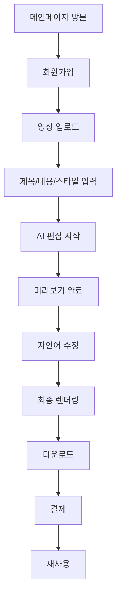

# AI 영상편집 서비스 런칭 준비 마스터 플랜

> 목적:  
> 이 문서는 AI 영상 자동편집 SaaS를 실제 유료 서비스로 운영하기 전에 추가로 확정해야 할 **MVP 범위, 요금제/원가, 법무/보안, 베타테스트, GTM, 운영 지표**를 정리한 런칭 준비 마스터 문서이다.  
>  
> 기존 문서가 기술 엔진, 서비스 페이지, 메인페이지, 관리자 페이지 중심이었다면, 이 문서는 **서비스를 실제로 팔고 안정적으로 운영하기 위한 최종 보완 체크리스트** 역할을 한다.

---

## 0. 현재까지 준비된 문서 범위

현재까지 정리된 문서들은 다음 영역을 커버한다.

```txt
1. 기술 엔진 구조
   - 영상 업로드
   - AI 편집 타임라인 생성
   - Remotion / FFmpeg 기반 렌더링
   - 실시간 미리보기
   - 자연어 편집 명령

2. 서비스 운영 페이지 구조
   - 메인페이지
   - 로그인 / 회원가입
   - 온보딩
   - 대시보드
   - 새 영상 만들기
   - 결제 페이지
   - 결과물 페이지

3. 메인페이지 디자인 / 전환 구조
   - 국내외 AI 영상 서비스 레퍼런스
   - 고객 페인포인트
   - 히어로 섹션
   - CTA
   - 데모 프리뷰 UI
   - 전환 중심 랜딩 구성

4. 관리자 페이지 구조
   - 사용자 관리
   - 결제 / 구독 관리
   - 크레딧 관리
   - 렌더링 작업 관리
   - CS 콘솔
   - 프롬프트 / 모델 관리
   - 로그 / 감사 기록

5. 운영 보완 요소
   - 요금제 / 크레딧 정책
   - 온보딩
   - 템플릿 / 스타일 프리셋
   - 품질 평가
   - 원가 관리
   - 저작권 / 초상권
   - CS 정책
   - 팀 기능
   - 데이터 보관 정책
```

위 수준이면 **개발 착수용 큰그림**으로는 충분하다.  
하지만 실제 유료 고객을 받기 전에는 아래 7개 영역을 추가로 확정해야 한다.

---

# 1. 런칭 전 MVP 범위 확정

## 1.1 왜 필요한가?

현재 기획은 기능 범위가 넓다.

```txt
- 영상 업로드
- AI 자동 편집
- 실시간 미리보기
- 자연어 수정
- 자막 생성
- 최종 렌더링
- 요금제
- 관리자
- CS
- 팀 기능
- B2B 기능
- 브랜드 템플릿
- API 제공
```

이걸 한 번에 만들면 개발 범위가 과도하게 커지고, Cursor AI 또는 개발팀이 우선순위를 잘못 잡을 수 있다.

따라서 반드시 다음을 구분해야 한다.

```txt
1. 1차 MVP 필수 기능
2. 런칭 후 1~2개월 내 추가할 기능
3. 유료 전환 확인 후 개발할 기능
4. B2B 고객 확보 후 개발할 기능
```

---

## 1.2 1차 MVP 필수 기능

1차 MVP는 **AI 영상편집 서비스의 핵심 가치가 실제로 전달되는지 확인하는 것**이 목적이다.

### 필수 사용자 기능

```txt
- 회원가입 / 로그인
- 영상 업로드
- 영상 제목 입력
- 영상 내용 / 목적 입력
- 원하는 편집 스타일 선택
- AI 자동 편집 실행
- 자동 자막 생성
- 9:16 쇼츠 미리보기
- 자연어로 간단 수정
  - 자막 크게
  - 더 빠르게
  - 인트로 삭제
  - BGM 줄이기
- 최종 MP4 렌더링
- 결과물 다운로드
- 크레딧 차감
```

### 필수 관리자 기능

```txt
- 사용자 목록 조회
- 프로젝트 목록 조회
- 영상 업로드 상태 확인
- AI 편집 작업 상태 확인
- 렌더링 상태 확인
- 실패 작업 재시도
- 크레딧 수동 지급 / 차감
- 결제 내역 확인
- 사용자 문의 확인
```

### 필수 결제 기능

```txt
- 무료 크레딧 지급
- 유료 크레딧 구매
- 기본 구독 플랜
- 결제 성공 / 실패 처리
- 결제 후 크레딧 자동 지급
- 관리자 수동 보정 기능
```

---

## 1.3 1차 MVP에서 제외할 기능

아래 기능은 좋아 보이지만 MVP 단계에서는 제외하는 것이 좋다.

```txt
- 팀 기능
- 조직 / 워크스페이스 기능
- B2B 견적서 발행 자동화
- 복잡한 타임라인 수동 편집
- 다중 브랜드 템플릿 관리
- API 제공
- 외부 서비스 연동
- 협업 편집
- 댓글 / 승인 워크플로우
- 고급 분석 대시보드
- 복수 언어 자동 더빙
- 고급 얼굴 추적 편집
- 영상 내 객체 추적 편집
```

이 기능들은 기술적으로는 중요하지만, 초기 고객이 결제할지를 검증하는 데 반드시 필요한 기능은 아니다.

---

## 1.4 MVP 성공 기준

MVP의 목표는 “기능이 많다”가 아니라 “사용자가 처음 만든 AI 편집본을 쓸 수 있다”이다.

초기 성공 기준은 다음과 같이 잡는다.

| 지표 | 목표 |
|---|---:|
| 회원가입 후 첫 프로젝트 생성률 | 50% 이상 |
| 영상 업로드 완료율 | 70% 이상 |
| AI 미리보기 완료율 | 60% 이상 |
| 미리보기 후 다운로드율 | 30% 이상 |
| 다운로드 후 재사용률 | 20% 이상 |
| 평균 수정 명령 횟수 | 3회 이하 |
| 렌더링 실패율 | 5% 이하 |
| 결과물 만족도 | 4.0 / 5.0 이상 |

---

## 1.5 MVP 범위 요약

```txt
해야 하는 것:
- AI가 자동으로 편집한 영상을 보여주는 핵심 경험
- 자막 / 컷편집 / 스타일 프리셋 / 최종 렌더링
- 결제와 크레딧
- 최소 관리자 기능

하지 말아야 하는 것:
- 캡컷 같은 전체 편집툴
- 고급 협업 기능
- 복잡한 수동 편집
- 대형 B2B 기능
- API 플랫폼화
```

---

# 2. 요금제·크레딧·원가 시뮬레이션

## 2.1 왜 가장 중요한가?

AI 영상편집 서비스는 원가가 높다.

원가 항목은 다음과 같다.

```txt
- 영상 업로드 트래픽
- 원본 파일 저장 비용
- 프록시 영상 생성 비용
- STT 비용
- 장면 분석 비용
- OCR / 객체 탐지 비용
- LLM 타임라인 생성 비용
- 실시간 미리보기 서버 비용
- 최종 렌더링 CPU/GPU 비용
- 결과물 저장 비용
- 다운로드 트래픽 비용
- 실패 렌더링 재시도 비용
```

요금제를 잘못 설계하면 **사용자가 늘수록 적자**가 발생한다.

---

## 2.2 기본 과금 원칙

추천 원칙은 다음과 같다.

```txt
1. 미리보기 단계는 최대한 무료처럼 느끼게 한다.
2. 최종 고화질 렌더링에서 크레딧을 차감한다.
3. 영상 길이에 따라 비용이 증가해야 한다.
4. 무료 사용자는 영상 길이 / 저장 기간 / 다운로드 품질을 제한한다.
5. 실패한 렌더링은 자동 환급한다.
6. 반복 재렌더링은 일정 횟수 이후 차감한다.
```

---

## 2.3 크레딧 차감 구조 예시

초기에는 단순한 구조가 좋다.

| 작업 | 차감 방식 |
|---|---|
| 영상 업로드 | 무료 |
| 프록시 생성 | 무료 또는 내부 원가 처리 |
| 음성 인식 / 자막 생성 | 영상 길이 기준 일부 차감 |
| AI 편집안 생성 | 프로젝트당 소량 차감 |
| 미리보기 | 무료 |
| 720p 최종 렌더링 | 분당 크레딧 차감 |
| 1080p 최종 렌더링 | 720p 대비 1.5~2배 차감 |
| 4K 렌더링 | 고급 플랜 전용 |
| 재렌더링 | 1회 무료, 이후 차감 |
| 실패 렌더링 | 자동 환급 |

---

## 2.4 예시 크레딧 모델

> 아래 숫자는 실제 원가 계산 전의 예시이다.  
> 실제 운영 전 반드시 AI 모델 비용, 서버 비용, 저장 비용을 기반으로 재계산해야 한다.

```txt
1 크레딧 = 내부 기준 10원 가치
무료 가입 보너스 = 300 크레딧
1분 720p 렌더링 = 100 크레딧
1분 1080p 렌더링 = 180 크레딧
AI 분석 1회 = 30 크레딧
AI 편집안 재생성 1회 = 50 크레딧
```

---

## 2.5 요금제 예시

| 플랜 | 가격 | 월 크레딧 | 대상 |
|---|---:|---:|---|
| Free | 0원 | 300 | 체험 사용자 |
| Starter | 19,900원 | 2,000 | 개인 크리에이터 |
| Pro | 49,000원 | 6,000 | 강사 / 마케터 |
| Studio | 99,000원 | 15,000 | 콘텐츠팀 / 학원 |
| Academy | 협의 | 맞춤 | 교육기관 / 출판사 |
| Enterprise | 협의 | 맞춤 | 대형 조직 / API 연동 |

---

## 2.6 무료 플랜 제한

무료 사용자는 원가 방어가 중요하다.

```txt
무료 플랜 제한:
- 최대 업로드 영상 길이: 3분
- 최대 결과물 길이: 30초
- 720p 다운로드만 허용
- 워터마크 포함
- 원본 파일 3일 보관
- 결과물 7일 보관
- 월 무료 크레딧 초과 시 결제 필요
```

---

## 2.7 유료 플랜 제한

```txt
Starter:
- 최대 업로드 영상 길이: 15분
- 최대 결과물 길이: 3분
- 720p / 1080p 다운로드
- 워터마크 제거
- 결과물 30일 보관

Pro:
- 최대 업로드 영상 길이: 60분
- 최대 결과물 길이: 10분
- 브랜드 스타일 저장
- 자막 스타일 커스터마이징
- 결과물 90일 보관

Studio:
- 팀원 초대
- 브랜드 템플릿
- 우선 렌더링
- 대량 작업
- 월간 사용량 리포트
```

---

## 2.8 원가 추적 지표

관리자 페이지에서 반드시 봐야 하는 원가 지표는 다음과 같다.

```txt
- 사용자 1명당 평균 원가
- 프로젝트 1개당 평균 원가
- 1분 영상 렌더링당 평균 원가
- 무료 유저 총 원가
- 유료 유저 총 원가
- 플랜별 마진율
- 실패 렌더링 비용
- GPU / CPU 사용률
- 스토리지 비용
- 다운로드 트래픽 비용
```

---

# 3. 법무·정책 문서

## 3.1 왜 필요한가?

영상 편집 서비스는 저작권, 초상권, 개인정보 문제가 매우 쉽게 발생한다.

사용자는 다음과 같은 콘텐츠를 업로드할 수 있다.

```txt
- 타인의 유튜브 영상
- 방송 클립
- 저작권 음악이 들어간 영상
- 타인의 얼굴이 나온 영상
- 학생 얼굴이 나온 수업 영상
- 교재 / 문제집 / PDF
- 학원 내부 강의 자료
- 경쟁 강사의 강의 영상
```

따라서 유료 서비스 전 반드시 법무 정책을 준비해야 한다.

---

## 3.2 필수 정책 문서

최소한 아래 문서가 필요하다.

```txt
1. 이용약관
2. 개인정보처리방침
3. 환불정책
4. 업로드 콘텐츠 정책
5. 저작권 신고 정책
6. AI 결과물 책임 고지
7. 데이터 보관 / 삭제 정책
8. 청소년 / 학생 얼굴 포함 영상 정책
9. 교육자료 / 교재 / 시험지 업로드 관련 책임 고지
```

---

## 3.3 업로드 콘텐츠 정책 핵심 문구 방향

서비스는 다음 원칙을 명확히 고지해야 한다.

```txt
- 사용자는 자신이 권리를 보유하거나 적법하게 사용할 수 있는 콘텐츠만 업로드해야 한다.
- 타인의 얼굴, 음성, 강의, 음악, 저작물이 포함된 경우 필요한 동의와 권리를 확보해야 한다.
- 회사는 사용자가 업로드한 콘텐츠의 권리 적법성을 사전에 모두 검증하지 않는다.
- 권리 침해 신고가 들어오면 회사는 해당 콘텐츠를 비공개 또는 삭제할 수 있다.
- 사용자의 위법한 콘텐츠 업로드로 발생한 책임은 사용자에게 있다.
```

---

## 3.4 교육자료 관련 특수 정책

노바AI 고객층은 학원 선생님과 교육 콘텐츠 제작자가 많을 가능성이 높다.  
따라서 교육자료 관련 책임 범위를 반드시 정해야 한다.

```txt
- 교재 / 문제집 / 시험지 / PDF 업로드 시 사용자가 적법한 이용권을 보유해야 한다.
- 상업 출판물의 무단 편집 / 배포는 제한된다.
- AI가 생성한 해설 영상도 원본 자료의 저작권 문제를 자동으로 해결해주지 않는다.
- 사용자는 결과물을 공개 / 판매 / 배포하기 전에 권리 관계를 확인해야 한다.
```

---

## 3.5 환불정책 방향

AI 결과물은 주관적 만족도가 개입되므로 환불 기준을 명확히 해야 한다.

추천 기준:

| 상황 | 처리 |
|---|---|
| 결제 후 크레딧 미사용 | 일정 기간 내 환불 가능 |
| 크레딧 사용 후 단순 변심 | 환불 제한 |
| 렌더링 실패 | 사용 크레딧 자동 환급 |
| 시스템 오류로 결과물 생성 불가 | 크레딧 환급 또는 결제 환불 |
| 결과물 품질 불만족 | 미리보기 단계에서 수정 유도, 최종 렌더링 후 단순 품질 불만은 제한 |
| 중복 결제 | 확인 후 환불 |
| 구독 갱신 후 미사용 | 정책에 따라 부분 환불 또는 환불 제한 |

---

# 4. 보안·개인정보·파일 접근 정책

## 4.1 왜 필요한가?

영상 파일은 개인정보와 민감정보를 포함할 가능성이 높다.

예를 들어:

```txt
- 학생 얼굴
- 수업 장면
- 사무실 내부 영상
- 고객 인터뷰
- 비공개 강의
- 기업 내부 교육자료
- 개인 음성
```

따라서 파일 접근 권한과 감사 로그를 강하게 설계해야 한다.

---

## 4.2 기본 보안 원칙

```txt
1. 모든 사용자 파일은 기본 비공개로 저장한다.
2. 파일 접근은 Signed URL 방식으로 제한한다.
3. Signed URL은 짧은 만료 시간을 가진다.
4. 관리자도 원본 파일에 무제한 접근할 수 없게 한다.
5. 관리자 파일 접근 시 반드시 감사 로그를 남긴다.
6. 사용자가 프로젝트 삭제를 요청하면 원본 / 프록시 / 결과물을 모두 삭제한다.
7. 보관 기간이 지난 파일은 자동 삭제한다.
```

---

## 4.3 관리자 권한 분리

관리자 역할은 최소한 아래처럼 나누는 것이 좋다.

| 역할 | 권한 |
|---|---|
| Super Admin | 전체 설정, 결제, 크레딧, 사용자, 파일 접근 |
| Operations Admin | 사용자/작업/CS 관리 |
| Finance Admin | 결제/환불/세금계산서 관리 |
| Support Agent | 문의 대응, 제한적 프로젝트 조회 |
| Developer | 시스템 로그, 작업 큐, 오류 로그 확인 |
| Viewer | 통계 조회만 가능 |

---

## 4.4 감사 로그 필수 항목

관리자 페이지는 아래 활동을 반드시 기록해야 한다.

```txt
- 관리자 로그인
- 사용자 상세 페이지 조회
- 사용자 파일 미리보기
- 원본 파일 다운로드
- 크레딧 수동 지급
- 크레딧 수동 차감
- 환불 처리
- 결제 상태 변경
- 렌더링 작업 재시도
- 프로젝트 삭제
- 사용자 계정 정지
```

감사 로그에는 다음 정보가 필요하다.

```txt
- admin_id
- action_type
- target_user_id
- target_project_id
- target_resource_id
- before_value
- after_value
- ip_address
- user_agent
- created_at
```

---

## 4.5 파일 보관 정책

예시 정책:

| 사용자 유형 | 원본 파일 | 프록시 파일 | 결과물 | 프로젝트 데이터 |
|---|---:|---:|---:|---:|
| 무료 사용자 | 3일 | 7일 | 7일 | 30일 |
| Starter | 14일 | 30일 | 30일 | 90일 |
| Pro | 30일 | 60일 | 90일 | 180일 |
| Studio | 60일 | 90일 | 180일 | 1년 |
| Enterprise | 계약 기준 | 계약 기준 | 계약 기준 | 계약 기준 |

---

# 5. 베타테스트 운영 전략

## 5.1 왜 베타가 필요한가?

AI 영상편집 서비스는 기능 구현보다 **결과물 품질 검증**이 중요하다.

사용자는 단순히 “영상이 생성되었다”가 아니라 다음을 본다.

```txt
- 이 영상을 실제로 올릴 수 있는가?
- 자막이 자연스러운가?
- 컷 편집이 어색하지 않은가?
- 템포가 좋은가?
- 내 의도에 맞게 편집되었는가?
- 수정 요청을 잘 알아듣는가?
```

따라서 정식 출시 전 베타 고객으로 품질을 확인해야 한다.

---

## 5.2 베타 모집 대상

노바AI 기준 추천 베타 대상:

```txt
1순위: 학원 선생님
2순위: 교육 콘텐츠 제작자
3순위: 온라인 강의 판매자
4순위: 인스타 / 쇼츠 마케터
5순위: 스타트업 대표 / 소규모 사업자
```

초기에는 기존 노바AI 고객 또는 학원 선생님 네트워크에서 20~50명을 모집하는 것이 좋다.

---

## 5.3 베타 제공 혜택

```txt
- 무료 크레딧 지급
- 베타 기간 Pro 기능 무료 사용
- 피드백 제공 시 추가 크레딧
- 정식 출시 후 할인 쿠폰
- 우수 사례 인터뷰 시 평생 할인 또는 고액 크레딧 지급
```

---

## 5.4 베타 테스트 시나리오

베타 사용자에게 아래 미션을 제공한다.

```txt
미션 1:
- 3분 이하 강의 영상을 업로드한다.
- "빠른 쇼츠 스타일"로 30초 영상을 만든다.

미션 2:
- 문제 이미지 또는 PDF와 강의 영상을 업로드한다.
- "강의 해설 스타일"로 영상을 만든다.

미션 3:
- 생성된 영상에 자연어 수정 명령을 입력한다.
- 예: "자막을 더 크게 해줘", "인트로를 줄여줘"

미션 4:
- 최종 MP4를 다운로드한다.
- 실제 SNS 또는 수업 자료로 사용할 수 있는지 평가한다.
```

---

## 5.5 베타 성공 기준

| 지표 | 목표 |
|---|---:|
| 베타 신청자 수 | 50명 이상 |
| 실제 사용률 | 60% 이상 |
| 첫 프로젝트 완료율 | 50% 이상 |
| 미리보기 완료율 | 60% 이상 |
| 최종 다운로드율 | 30% 이상 |
| 만족도 | 4.0 / 5.0 이상 |
| 재사용 의향 | 40% 이상 |
| 유료 전환 의향 | 20% 이상 |
| 렌더링 실패율 | 5% 이하 |

---

## 5.6 베타 피드백 항목

피드백 폼에는 아래 항목을 포함한다.

```txt
1. 사용 목적
2. 업로드한 영상 유형
3. 선택한 편집 스타일
4. 결과물 만족도
5. 가장 마음에 든 점
6. 가장 불편한 점
7. 실제로 사용할 수 있는 결과물인지
8. 자막 품질
9. 컷 편집 품질
10. 속도 / 템포
11. 수정 명령 품질
12. 결제 의향
13. 적정 가격
```

---

# 6. 고객획득/GTM 전략

## 6.1 타깃 세그먼트

AI 영상편집 서비스는 여러 고객군을 가질 수 있다.

```txt
1. 학원 선생님
2. 온라인 강사
3. 교육 콘텐츠 제작자
4. 인스타 / 쇼츠 마케터
5. 스타트업 대표
6. 소상공인
7. 콘텐츠 대행사
8. 출판사 / 교육기관
```

노바AI 기준 1차 타깃은 아래가 적합하다.

```txt
1순위: 학원 선생님
2순위: 교육 콘텐츠 제작자
3순위: 소규모 사업자 / 스타트업
```

---

## 6.2 타깃별 핵심 메시지

| 타깃 | 핵심 메시지 |
|---|---|
| 학원 선생님 | 문제와 강의 영상을 넣으면 해설 쇼츠가 자동으로 생성됩니다 |
| 온라인 강사 | 긴 강의에서 핵심 구간만 뽑아 홍보용 쇼츠를 만드세요 |
| 마케터 | 제품 설명과 영상만 넣으면 광고 영상을 자동 편집합니다 |
| 스타트업 대표 | 촬영본만 넣으면 서비스 소개 영상이 완성됩니다 |
| 콘텐츠 대행사 | 반복 편집 작업을 AI로 자동화해 제작 단가를 낮추세요 |
| 출판사 / 교육기관 | 교재 기반 해설 영상을 대량 생성하세요 |

---

## 6.3 랜딩페이지 분화

메인페이지 하나로 모든 고객을 설득하기 어렵다.  
초기에는 최소 3개 랜딩이 필요하다.

| URL | 타깃 | 핵심 카피 |
|---|---|---|
| `/ai-shorts` | 크리에이터 / 마케터 | 긴 영상을 넣으면 AI가 쇼츠로 편집합니다 |
| `/ai-lecture-video` | 학원 선생님 / 강사 | 문제와 강의 영상을 넣으면 AI가 해설 쇼츠를 만듭니다 |
| `/ai-product-video` | 사업자 / 스타트업 | 제품 설명만 넣으면 AI가 광고 영상을 만듭니다 |

노바AI는 특히 `/ai-lecture-video`를 가장 먼저 만들어야 한다.

---

## 6.4 초기 마케팅 채널

```txt
1. 기존 노바AI 고객 대상 이메일 / 문자
2. 학원 선생님 대상 오픈채팅 / 커뮤니티
3. 인스타그램 릴스
4. 쓰레드 콘텐츠
5. 유튜브 쇼츠 데모
6. 학강마 / 교사 커뮤니티 배너
7. 교육 인플루언서 제휴
8. 베타 체험단 모집
```

---

## 6.5 데모 콘텐츠 전략

이 서비스는 말로 설명하는 것보다 데모 영상이 중요하다.

반드시 만들어야 할 데모:

```txt
1. 강의 영상 → 30초 쇼츠 변환
2. 문제 이미지 → 해설 영상 생성
3. 제품 소개 영상 자동 편집
4. 긴 인터뷰 → 핵심 요약 쇼츠
5. 자연어 수정 시연
   - "자막을 더 크게"
   - "속도를 빠르게"
   - "인트로를 삭제"
```

---

## 6.6 초기 유료 전환 전략

```txt
- 무료 크레딧으로 첫 미리보기 제공
- 워터마크 포함 무료 다운로드
- 워터마크 제거는 유료
- 고화질 1080p 다운로드는 유료
- 긴 영상 편집은 유료
- 결과물 보관 기간 연장은 유료
- 브랜드 템플릿 저장은 Pro 이상
```

핵심은 사용자가 먼저 결과물을 보고 “이 정도면 쓸 수 있겠다”라고 느끼게 하는 것이다.

---

# 7. 운영 지표·이벤트 트래킹 설계

## 7.1 핵심 운영 지표

초기에는 아래 10개 지표만 매일 보면 된다.

```txt
1. 오늘 가입자 수
2. 오늘 영상 업로드 수
3. 첫 미리보기 완료율
4. 최종 렌더링 수
5. 다운로드 수
6. 결제 전환율
7. 유료 매출
8. AI / 렌더링 원가
9. 렌더링 실패율
10. 사용자 1명당 평균 원가
```

가장 중요한 지표는 **첫 미리보기 완료율**이다.

---

## 7.2 핵심 퍼널



---

## 7.3 이벤트 트래킹 목록

프론트엔드와 백엔드에서 아래 이벤트를 기록한다.

```txt
page_view
cta_click
signup_started
signup_completed
login_completed
project_created
video_upload_started
video_upload_completed
video_upload_failed
brief_submitted
ai_edit_started
ai_edit_completed
ai_edit_failed
preview_started
preview_completed
natural_language_edit_submitted
natural_language_edit_completed
render_started
render_completed
render_failed
download_clicked
payment_started
payment_completed
payment_failed
credit_spent
credit_refunded
subscription_started
subscription_cancelled
```

---

## 7.4 이벤트 데이터 예시

```json
{
  "event": "preview_completed",
  "user_id": "user_123",
  "project_id": "project_456",
  "plan": "free",
  "video_duration_sec": 180,
  "output_duration_sec": 35,
  "style_preset": "fast_shorts",
  "ai_model": "gemini_3_1_pro",
  "timeline_prompt_version": "v1.2",
  "created_at": "2026-06-25T13:00:00+09:00"
}
```

---

## 7.5 품질 지표

AI 결과물 품질을 개선하려면 아래 지표를 관리해야 한다.

```txt
- 평균 수정 명령 횟수
- 사용자 직접 재생성 횟수
- 다운로드 전환율
- 자막 오류 신고율
- 컷 편집 오류 신고율
- 렌더링 실패율
- 재사용률
- 스타일 프리셋별 만족도
- 프롬프트 버전별 다운로드율
```

---

# 8. 장애 대응 런북

## 8.1 왜 필요한가?

영상 서비스는 작업 시간이 길고, 외부 AI 모델과 렌더링 서버에 의존한다.  
따라서 장애가 반드시 발생한다.

---

## 8.2 주요 장애 시나리오

```txt
- 영상 업로드 실패
- 프록시 생성 실패
- STT 실패
- AI 편집 타임라인 생성 실패
- 미리보기 로딩 실패
- 렌더링 큐 지연
- 최종 렌더링 실패
- 영상/오디오 싱크 밀림
- 다운로드 링크 만료
- 결제 성공 후 크레딧 미지급
- 결제 웹훅 실패
- 저장소 권한 오류
```

---

## 8.3 관리자 액션

관리자 페이지에는 다음 액션이 필요하다.

```txt
- 작업 재시도
- 작업 취소
- 작업 우선순위 변경
- 크레딧 환급
- 사용자에게 안내 메시지 발송
- 다운로드 링크 재생성
- 결제 웹훅 재처리
- 수동 크레딧 지급
- 장애 공지 등록
```

---

## 8.4 자동 복구 정책

| 장애 | 자동 처리 |
|---|---|
| 업로드 실패 | 사용자 재업로드 안내 |
| 프록시 생성 실패 | 자동 재시도 2회 |
| STT 실패 | 다른 모델로 fallback |
| AI 편집 실패 | 기본 템플릿 기반 편집안 생성 |
| 렌더링 실패 | 자동 재시도 2회 |
| 결제 웹훅 실패 | 웹훅 재처리 큐 등록 |
| 다운로드 링크 만료 | 사용자 요청 시 재발급 |

---

# 9. Cursor AI 개발 지시 요약

Cursor AI에게 전달할 때는 아래 원칙을 명확히 지시한다.

```txt
이 프로젝트는 캡컷 전체를 복제하는 서비스가 아니다.
1차 목표는 사용자가 원본 영상, 제목, 설명, 스타일을 입력하면 AI가 자동으로 9:16 쇼츠 편집본을 만들고 실시간 미리보기로 확인한 뒤 MP4로 다운로드하는 MVP를 구축하는 것이다.

우선순위:
1. 사용자 첫 성공 경험
2. AI 편집 타임라인 생성
3. 미리보기
4. 최종 렌더링
5. 크레딧 과금
6. 관리자에서 실패 작업 처리

제외할 것:
- 복잡한 수동 편집툴
- 다중 팀 협업
- 고급 B2B 권한
- API 플랫폼화
- 모바일 앱
```

---

## 9.1 추천 개발 단계

```txt
Phase 1. 기본 SaaS 구조
- Next.js 프로젝트 세팅
- 회원가입 / 로그인
- 대시보드
- 프로젝트 생성
- 영상 업로드

Phase 2. 영상 처리 기본
- 원본 파일 저장
- 프록시 생성
- 썸네일 추출
- STT / 자막 생성

Phase 3. AI 편집
- 제목 / 내용 / 스타일 입력
- AI Timeline JSON 생성
- 스타일 프리셋 적용
- 기본 자막 / 컷 편집 적용

Phase 4. 미리보기
- Remotion Player 연동
- Timeline JSON 기반 미리보기
- 자연어 수정 명령

Phase 5. 최종 렌더링
- Remotion Renderer / FFmpeg 렌더링
- MP4 저장
- 다운로드 링크 생성

Phase 6. 결제 / 크레딧
- 무료 크레딧 지급
- 크레딧 차감
- 결제 연동
- 관리자 수동 보정

Phase 7. 관리자 / 운영
- 사용자 관리
- 프로젝트 관리
- 렌더링 작업 관리
- 결제 관리
- CS 관리
- 감사 로그
```

---

# 10. 최종 우선순위

지금 상태에서 가장 먼저 추가 확정해야 하는 것은 다음 3가지다.

```txt
1. MVP 범위 확정
2. 요금제 / 크레딧 / 원가 숫자
3. 법무 / 보안 / 환불 정책
```

그 다음 순서는 다음과 같다.

```txt
4. 베타테스트 운영 전략
5. 고객획득 / GTM 전략
6. 운영 지표 / 이벤트 트래킹
7. 장애 대응 런북
```

---

# 11. 최종 결론

현재까지 정리된 문서만으로도 **개발 착수는 가능**하다.

다만 바로 유료 서비스를 운영하려면 아래 요소를 반드시 추가해야 한다.

```txt
- MVP 범위를 좁힌다.
- 무료/유료 크레딧 정책을 숫자로 확정한다.
- 원가 지표를 관리자에서 추적한다.
- 저작권/초상권/환불/보관 정책을 만든다.
- 관리자 파일 접근과 감사 로그를 설계한다.
- 베타 고객 20~50명으로 결과물 품질을 검증한다.
- 첫 미리보기 완료율을 핵심 지표로 관리한다.
```

서비스의 초기 방향은 다음 한 문장으로 정의한다.

> 원본 영상, 제목, 설명, 스타일만 넣으면 AI가 자동으로 쇼츠 편집본을 만들고, 사용자는 실시간 미리보기에서 자연어로 수정한 뒤 MP4로 다운로드할 수 있는 AI 영상편집 SaaS.

노바AI 관점에서는 일반 AI 영상편집기보다 아래 포지셔닝이 더 강하다.

> 문제, PDF, 강의 영상을 넣으면 AI가 해설 쇼츠와 교육용 영상을 자동으로 만들어주는 교육 특화 AI 영상 제작 서비스.

따라서 1차 MVP는 일반 크리에이터보다 **학원 선생님 / 교육 콘텐츠 제작자**를 중심으로 설계하는 것이 가장 현실적이다.
