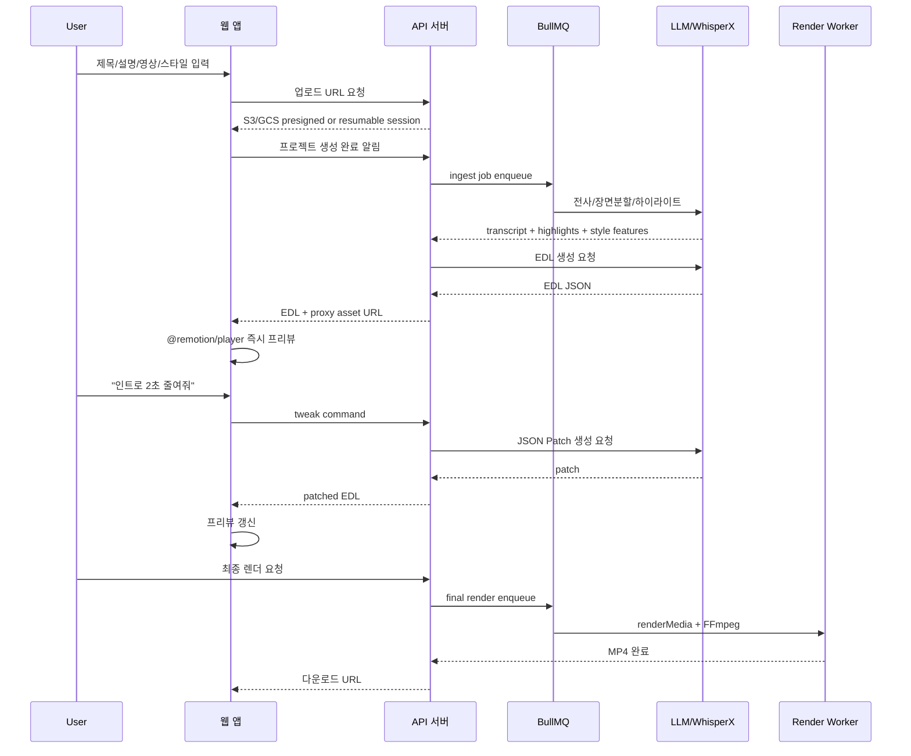
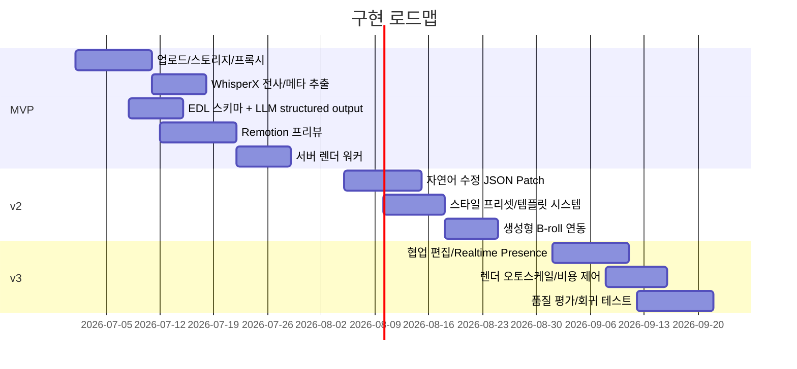

# 실시간 AI 기반 영상편집 서비스 구축 리서치

## 요약

이 요구사항에 가장 맞는 구현 전략은 **“AI가 완성 MP4를 실시간으로 다시 렌더링하는 서비스”가 아니라, “AI가 편집 타임라인 EDL JSON을 만들고, 브라우저는 그 JSON을 즉시 재생 가능한 프리뷰 상태로 반영하며, 최종 확정 시에만 서버에서 고화질 렌더링하는 서비스”**입니다. Remotion은 React 컴포넌트를 브라우저에 임베드해 데이터 변경 시 즉시 반응하는 `@remotion/player`를 제공하고, 서버 측에서는 `@remotion/renderer`와 `renderMedia()`로 최종 영상을 렌더링할 수 있어 이 구조와 매우 잘 맞습니다. Remotion은 파라미터화된 비디오와 `inputProps` 중심 설계를 권장하고 있습니다. citeturn8view0turn8view1turn8view2turn13search1turn13search4

빠른 MVP가 목표라면 Shotstack 또는 Creatomate를 고려할 수 있습니다. Shotstack은 Edit JSON을 서버에서 렌더링하는 REST API와 더불어, 브라우저 안에서 **timeline, canvas preview, export**를 제공하는 Studio SDK를 공개하고 있습니다. Creatomate도 REST API와 별도로 **Preview SDK**를 제공해 최종 MP4 생성 전 브라우저 내 실시간 프리뷰를 지원하지만, 공식 문서상 Preview SDK는 **주로 데스크톱 환경과 Chromium 계열 브라우저에 최적화**되어 있으며, 지원되지 않는 환경에서는 API 기반 저해상도 프리뷰를 권장합니다. 따라서 범용성과 장기 커스터마이징 면에서는 Remotion+FFmpeg가 가장 강하고, 빠른 API 통합과 일정 단축 면에서는 Shotstack/Creatomate가 유리합니다. citeturn8view5turn11view3turn9view0turn9view1turn8view6

AI 계층은 기능을 나누는 편이 안정적입니다. 음성 인식용으로는 WhisperX가 **단어 단위 timestamp**, diarization, batched inference를 제공해 자막·하이라이트 추출에 유리합니다. EDL JSON 생성에는 OpenAI, Gemini, Claude의 **structured outputs / JSON schema 강제 출력** 기능을 쓰는 것이 적합합니다. 이렇게 하면 “자연어 편집 명령 → JSON Patch 또는 새 EDL 조각”의 경로를 안정적으로 만들 수 있습니다. 생성형 B-roll이나 보정 샷이 필요하면 Runway API를 별도 서브시스템으로 붙이는 것이 맞지만, Runway는 본질적으로 **비동기 태스크 기반 생성 API**이며, deterministic한 멀티트랙 편집 타임라인 엔진을 대신하진 않습니다. citeturn10view0turn9view7turn9view8turn9view6turn17search4turn9view5

권장 결론은 다음과 같습니다. **주력 아키텍처는 Remotion + FFmpeg + WhisperX + LLM structured outputs + BullMQ/Redis + Postgres/Supabase + S3/GCS**입니다. 단, “개발 속도 최우선”이면 **Shotstack Studio SDK 또는 Creatomate Preview SDK로 MVP를 먼저 낸 뒤**, 이후 Remotion 기반 자체 편집 엔진으로 전환하는 2단계 전략이 현실적입니다. citeturn8view5turn8view6turn10view1turn10view3turn10view4turn10view5turn14search0turn14search8

## 권장 아키텍처

아래 구조는 사용자 입력인 **제목, 설명, 소스 비디오/에셋, 스타일**을 받아 EDL JSON을 생성하고, 브라우저는 즉시 프리뷰를 보여주며, 최종 승인 후에만 서버에서 HQ 렌더링을 수행하는 방식입니다. Remotion은 runtime prop 변경에 반응하는 Player를 제공하고, FFmpeg는 프록시 생성, 무음 감지, 스케일링, concat, 최종 인코딩에 적합합니다. WhisperX는 정밀 타임스탬프를, BullMQ는 큐 기반 작업 분리를, Supabase/Postgres는 프로젝트 상태 저장과 Realtime 이벤트 브로드캐스트에 적합합니다. citeturn11view1turn3search5turn12search0turn12search1turn10view0turn10view1turn10view2turn10view3

```mermaid
flowchart LR
    U[사용자 입력\n제목 / 설명 / 소스 영상 / 스타일 / 자연어 수정] --> A[업로드 API]
    A --> S3[(S3 또는 GCS 원본 저장)]
    A --> DB[(Postgres / Supabase)]

    S3 --> Q1[Ingest Queue\nBullMQ/Redis]
    Q1 --> P1[프록시 생성\nFFmpeg 720p/H.264/AAC]
    Q1 --> P2[메타데이터 추출\nffprobe / duration / fps / waveform]
    Q1 --> P3[전사/정렬\nWhisperX]

    P1 --> DB
    P2 --> DB
    P3 --> DB

    DB --> L1[Transcript Agent]
    DB --> L2[Highlight Agent]
    DB --> L3[Style Agent]
    U --> L4[Timeline Agent]

    L1 --> EDL[EDL JSON]
    L2 --> EDL
    L3 --> EDL
    L4 --> EDL

    EDL --> PREV[@remotion/player\n브라우저 프리뷰]
    PREV --> NL[자연어 수정]
    NL --> PATCH[JSON Patch / EDL 갱신]
    PATCH --> EDL

    EDL --> RQ[Render Queue]
    RQ --> RENDER[@remotion/renderer + FFmpeg\n고화질 서버 렌더]
    RENDER --> OUT[(최종 MP4 / 썸네일 / 자막)]
    OUT --> DB
```

실시간 프리뷰를 구현할 때 핵심은 **프록시 미디어와 선언적 타임라인**입니다. 사용자가 편집 명령을 입력할 때마다 MP4를 새로 만드는 대신, 브라우저는 proxy asset과 현재 EDL 상태만 다시 계산해 Paint/Re-render 합니다. Remotion Player는 React prop 변경에 즉시 반응하도록 설계되어 있고, Shotstack Studio SDK 또한 브라우저 기반의 timeline/canvas preview를 제공하며, Creatomate Preview SDK 역시 브라우저 프리뷰를 지원합니다. 따라서 “즉시성”은 인코딩이 아니라 **상태 반영 속도**로 달성하는 것이 맞습니다. citeturn11view1turn8view5turn7search2turn8view6

브라우저에서 더 낮은 지연의 프레임 단위 처리까지 원하면 WebCodecs를 고려할 수 있습니다. 다만 WebCodecs는 **Dedicated Worker에서 사용 가능하고**, 매우 저수준 제어와 하드웨어 가속을 제공하지만, 일부 주요 브라우저에서 Baseline이 아니므로 기본 프리뷰 엔진으로는 Remotion Player를 두고, 고성능/고사양 브라우저에 한해 고급 모드로 활성화하는 편이 안전합니다. citeturn8view3turn3search4turn8view4



## 핵심 구현 패턴

### EDL JSON을 시스템의 단일 진실 원천으로 두기

이 서비스의 중심은 “편집 결과물”이 아니라 “편집 결정 데이터”입니다. Remotion은 input props와 parameterized rendering을 공식적으로 권장하며, Shotstack도 Edit JSON을 시스템의 핵심 데이터 구조로 사용합니다. 이 요구사항에 맞춰, 프로젝트 상태는 아래와 같은 EDL/Timeline JSON으로 관리하는 것이 적합합니다. citeturn8view2turn9view0turn11view3

```ts
export type VideoProject = {
  id: string;
  title: string;
  description: string;
  aspectRatio: "9:16" | "16:9" | "1:1";
  stylePreset: string;
  assets: Asset[];
  transcript: TranscriptSegment[];
  timeline: Scene[];
  version: number;
};

export type Asset = {
  id: string;
  kind: "video" | "audio" | "image" | "subtitle";
  originalUrl: string;
  proxyUrl?: string;
  width?: number;
  height?: number;
  durationMs?: number;
  fps?: number;
};

export type TranscriptSegment = {
  startMs: number;
  endMs: number;
  text: string;
  words?: { startMs: number; endMs: number; text: string }[];
  speaker?: string;
  confidence?: number;
};

export type Scene = {
  id: string;
  startMs: number;
  durationMs: number;
  purpose: "hook" | "explain" | "demo" | "cutaway" | "cta";
  layers: Layer[];
  transitionIn?: "cut" | "fade" | "wipe";
  transitionOut?: "cut" | "fade" | "wipe";
};

export type Layer =
  | {
      type: "video";
      assetId: string;
      srcStartMs: number;
      srcEndMs: number;
      speed?: number;
      crop?: { x: number; y: number; w: number; h: number };
      transform?: { x: number; y: number; scale: number };
      effect?: "none" | "zoom-in" | "zoom-out" | "blur-bg";
    }
  | {
      type: "caption";
      text: string;
      startMs: number;
      endMs: number;
      style: "minimal" | "bold" | "highlight" | "education";
      emphasis?: string[];
    }
  | {
      type: "text";
      text: string;
      transform?: { x: number; y: number; scale: number };
      themeToken?: string;
    }
  | {
      type: "audio";
      assetId: string;
      startMs: number;
      endMs: number;
      volume?: number;
      ducking?: boolean;
    };
```

아래처럼 **AI가 자연어를 직접 UI로 조작하는 대신**, 항상 정형화된 JSON이나 Patch를 반환하게 하는 것이 중요합니다. OpenAI, Gemini, Claude 모두 JSON Schema 기반 structured outputs를 공식 지원하므로, EDL 생성과 수정 엔진에 잘 맞습니다. citeturn9view7turn9view8turn9view6

```json
{
  "action": "patch_timeline",
  "reason": "사용자가 인트로를 줄이고 자막을 더 크게 요청함",
  "patches": [
    { "op": "replace", "path": "/timeline/0/durationMs", "value": 1200 },
    { "op": "replace", "path": "/timeline/1/layers/2/style", "value": "bold" }
  ]
}
```

### 업로드·프록시·저지연 프리뷰 파이프라인

업로드는 브라우저가 오브젝트 스토리지에 직접 보내도록 설계하는 것이 좋습니다. S3는 presigned URL 업로드를 공식 지원하며, GCS는 signed URL 또는 resumable upload session URI를 사용할 수 있습니다. 대용량 영상은 네트워크 실패 복구와 속도 때문에 S3 multipart 또는 GCS resumable upload가 유리합니다. citeturn10view4turn10view5turn4search6

프록시 생성은 업로드 직후 비동기 ingest job에서 수행합니다. FFmpeg는 범용 미디어 변환기이며 filtergraph를 통해 trim, crop, silence detect, scale, overlay 등 대부분의 전처리를 수행할 수 있습니다. 일반적으로 **720p H.264/AAC, 짧은 GOP, 빠른 seek**용 프록시를 만들어 브라우저 프리뷰에 사용하고, 최종 렌더에서만 원본을 사용합니다. FFmpeg는 `silencedetect` 필터를 제공하고, concat demuxer도 공식 문서화되어 있습니다. citeturn3search5turn12search0turn12search1turn12search5

```bash
# 프록시 생성 예시
ffmpeg -i input.mp4 \
  -vf "scale=1280:-2" \
  -c:v libx264 -preset veryfast -crf 26 \
  -c:a aac -b:a 128k \
  -movflags +faststart \
  proxy_720p.mp4

# 무음 감지 예시
ffmpeg -i input.mp4 -af silencedetect=noise=-35dB:d=0.4 -f null -
```

WhisperX는 **word-level timestamps**, diarization, batched inference를 제공하므로, 한 문장 자막뿐 아니라 “강조 단어 하이라이트”, “무음 제거 후보”, “hook 구간 탐지”에 유리합니다. 이 결과는 transcript 테이블과 함께 EDL 생성용 특징량으로 저장하는 것이 좋습니다. citeturn10view0

### 브라우저 프리뷰는 Remotion Player 중심으로, WebCodecs는 선택적 고급 경로로

`@remotion/player`는 React 컴포넌트를 브라우저 안에서 플레이하고, props 변경 시 즉시 반응하도록 설계되어 있습니다. 즉, EDL JSON을 Remotion composition의 `inputProps`로 주입하면 UI 조작이나 자연어 명령 직후 프리뷰가 갱신됩니다. 이는 사용자가 원하는 “즉시 보여주는 편집 결과”에 가장 직접적인 경로입니다. citeturn11view1turn13search4

```tsx
import { Player } from "@remotion/player";
import { VideoComposition } from "./VideoComposition";

export function PreviewPane({ edl }: { edl: VideoProject }) {
  return (
    <Player
      component={VideoComposition}
      inputProps={{ edl }}
      durationInFrames={Math.ceil((edl.timeline.at(-1)!.startMs + edl.timeline.at(-1)!.durationMs) / 33.333)}
      compositionWidth={1080}
      compositionHeight={1920}
      fps={30}
      controls
      style={{ width: "100%", aspectRatio: "9 / 16" }}
    />
  );
}
```

고급 경로로는 WebCodecs를 쓸 수 있습니다. WebCodecs는 브라우저에서 encode/decode를 저수준으로 제어할 수 있고, per-frame 처리도 가능해 고성능 편집 UI에 유리합니다. 하지만 공식 문서와 MDN은 지원 편차와 낮은 레벨의 복잡성을 보여주므로, MVP에서는 **“기본 Remotion Preview + 선택적 WebCodecs acceleration”**이 바람직합니다. citeturn8view3turn8view4turn3search4

### 최종 렌더는 서버 큐에서 분리

최종 렌더는 서버 큐로 넘기는 것이 맞습니다. Remotion의 `renderMedia()`는 서버사이드 렌더의 권장 API이며, 브라우저 미리보기와 분리된 고품질 산출물을 생성하기에 적합합니다. 큐는 BullMQ가 안정적입니다. BullMQ는 Redis 기반 고성능 작업 큐이며, 수평 확장과 병렬 처리에 적합합니다. citeturn13search1turn11view0turn10view1

```ts
// render-job.ts
import { bundle } from "@remotion/bundler";
import { getCompositions, selectComposition, renderMedia } from "@remotion/renderer";

export async function renderFinalVideo(entry: string, inputProps: unknown, outputLocation: string) {
  const serveUrl = await bundle(entry);
  const comps = await getCompositions(serveUrl, { inputProps });
  const composition = selectComposition(comps, "Main");
  await renderMedia({
    composition,
    serveUrl,
    codec: "h264",
    outputLocation,
    inputProps,
  });
}
```

자연어 수정은 전체 EDL을 매번 새로 만들기보다 **JSON Patch 또는 scene-level replacement** 방식이 훨씬 실용적입니다. OpenAI, Gemini, Claude의 structured output을 이용해, `patches[]`, `reason`, `assumptions[]`, `requires_reanalysis[]` 같은 필드를 강제하면 Undo/Redo, diff, audit trail, collaborative editing이 쉬워집니다. 이는 공식 structured outputs 문서의 사용의도와도 맞습니다. citeturn9view7turn9view8turn9view6

## 스택과 후보 서비스 비교

### 권장 스택

| 레이어 | 권장안 | 대안 | 실무 코멘트 | 근거 |
|---|---|---|---|---|
| 웹 프론트 | Next.js + React | Vite + React | Remotion/Player와 궁합이 좋고 editor state 관리가 쉽습니다. | citeturn11view1turn13search4 |
| 즉시 프리뷰 | `@remotion/player` | Shotstack Studio SDK, Creatomate Preview SDK | Remotion은 완전 커스텀, Shotstack/Creatomate는 더 빠른 MVP에 유리합니다. | citeturn11view1turn8view5turn8view6 |
| 고급 브라우저 미디어 처리 | WebCodecs | MSE/Canvas 조합 | WebCodecs는 강력하지만 저수준이며 브라우저 지원 차이를 고려해야 합니다. | citeturn8view3turn3search4 |
| 전사/타임스탬프 | WhisperX | managed STT | word-level timestamp와 diarization이 장점입니다. | citeturn10view0 |
| EDL 생성 LLM | OpenAI / Gemini / Claude | 단일 벤더 고정 | JSON Schema 강제 출력으로 편집 파이프라인 안정성이 좋아집니다. | citeturn9view7turn9view8turn9view6 |
| 렌더 엔진 | Remotion + FFmpeg | Shotstack / Creatomate | 장기 커스터마이징 최우선이면 Remotion, 일정 최우선이면 API 서비스가 유리합니다. | citeturn8view1turn3search5turn9view0turn9view1 |
| 작업 큐 | BullMQ + Redis | Cloud Tasks/SQS | ingest, 분석, 렌더를 분리하고 병렬 worker 운영이 쉽습니다. | citeturn10view1 |
| 상태/메타 DB | Postgres / Supabase | 직접 Postgres + WebSocket | Supabase는 Postgres + Realtime + Storage가 한 번에 있어서 빠릅니다. | citeturn10view2turn10view3turn3search23 |
| 오브젝트 스토리지 | S3 / GCS | Supabase Storage | 대용량 영상은 presigned/resumable 패턴이 핵심입니다. | citeturn10view4turn10view5 |
| 생성형 컷어웨이/B-roll | Runway API | 내부 이미지/영상 생성기 | deterministic한 편집 엔진이 아니라 보조 생성 계층으로 쓰는 것이 적절합니다. | citeturn9view5turn17search4 |

### 후보 서비스 비교

| 후보 | API 가용성 | 실시간 프리뷰 | 비용 모델 | 커스터마이징 | 프로덕션 적합성 평가 | 근거 |
|---|---|---|---|---|---|---|
| Shotstack | Edit JSON을 POST해 렌더하는 REST API, Ingest/Serve API도 공개 | **있음**. Studio SDK가 browser-based timeline, canvas preview, export 제공 | PAYG는 분당 $0.30, 구독은 분당 $0.20, 시작가 $39/월 | 중상. Shotstack 데이터 모델 내부에서는 매우 빠름 | **높음**. 가장 “즉시 붙이기 쉬운” 상용 API 중 하나 | citeturn9view0turn8view5turn9view2 |
| Creatomate | REST API 공개, 템플릿/JSON 기반 생성 | **있음**. Preview SDK 제공. 다만 공식 문서상 데스크톱 및 Chromium 중심 | 무료 50 credits, 유료 플랜은 credits 기반. JS Preview SDK는 유료 플랜 기능 | 중상. 템플릿 편향이 강하지만 빠름 | **높음**. 특히 템플릿형 자동화에 유리 | citeturn9view1turn8view6turn9view3 |
| Remotion + FFmpeg | 자체 API를 구성해야 함. `@remotion/player`, `@remotion/renderer`, FFmpeg 조합 | **있음**. Player로 immediate preview 가능. 다만 에디터 UI는 직접 구축 | 자체 인프라 비용 + Remotion 라이선스 해당 시 적용. 무료 사용 조건과 Company License/Automators 조건 존재 | **매우 높음**. 가장 유연 | **매우 높음**. 장기적으로 가장 유리하지만 구현 난이도는 가장 높음 | citeturn11view1turn8view1turn14search0turn14search8turn3search5 |
| Runway | 공식 SDK/API 공개, 모델 접근과 워크플로/레시피 제공 | 편집 타임라인 프리뷰는 아님. 생성 태스크는 비동기이며 실시간 아바타는 별도 제품 | credits 기반, 1 credit = $0.01, 모델별 초당 과금 | 중간. 생성형 비디오/B-roll에는 강함, deterministic 편집엔 약함 | **보조 계층으로 높음**. 주 편집 엔진으로는 부적합 | citeturn9view5turn9view4turn17search4turn17search13 |
| Descript | 공식 API 문서 존재, 프로젝트 생성·미디어 import·edit 지원, early access/open beta 성격 | 전용 브라우저 프리뷰 SDK는 공개 문서에서 명확히 확인 어려움 | 제품 요금은 무료~유료 플랜, API는 early access/open beta | 중간. transcript-driven workflow에는 강함 | **중간**. 브라우저 즉시 프리뷰형 제품의 코어 엔진보다는 워크플로 자동화용 | citeturn15search1turn15search2turn16search1turn5search3 |
| CapCut unofficial | 공식 소비자 편집 제품은 강하지만, 공개 검색 범위에서 developer-grade backend render API는 명확히 확인 어려움. 비공식 draft tooling 존재 | 공식 SDK/preview 문서 확인 어려움 | 불명확 | 낮음. 비공식 의존 | **낮음**. 프로덕션 핵심 의존성으로 비추천 | citeturn6search0turn6search2turn6search3turn6search10 |

### 참고할 GitHub/예제 리포지토리

| 리포지토리 / 예제 | 무엇을 참고할지 | 성격 | 근거 |
|---|---|---|---|
| `remotion-dev/remotion` | 컴포지션 구조, Player/Renderer 전체 생태계 | 공식 | citeturn7search0 |
| `shotstack/shotstack-studio-sdk` | 브라우저 에디터 아키텍처, timeline/canvas preview | 공식 | citeturn7search1 |
| `shotstack/shotstack-sdk-node` | JSON edit API 서버 통합 | 공식 | citeturn7search9 |
| `shotstack/python-demos` | 렌더·폴링·webhook 예시 | 공식 예제 | citeturn7search5 |
| `Creatomate/creatomate-preview` | 브라우저 프리뷰 통합 패턴 | 공식 | citeturn7search2 |
| `Creatomate/video-preview-demo` | 즉시 프리뷰 앱 골격 | 공식 예제 | citeturn7search6 |
| `Creatomate/video-creator-demo` | 고급 비디오 에디터 앱 구조 | 공식 예제 | citeturn7search17 |
| `m-bain/whisperx` | word-level timestamp, diarization 파이프라인 | 사실상 표준 오픈소스 | citeturn10view0 |
| `runwayml/avatars-sdk-react` | 실시간 AI 캐릭터/비디오 인터랙션 UI 패턴 | 공식 | citeturn17search11 |
| `designcombo/react-video-editor` | 오픈소스 타임라인 UI/멀티트랙 에디터 참조 | 커뮤니티 | citeturn7search15 |
| `sambowenhughes/a-react-video-editor` | 브라우저 기본 편집기 골격 | 커뮤니티 | citeturn7search8 |

## 로드맵과 소요 추정

아래 추정은 **풀타임 1명 기준 person-weeks**입니다. 프론트/백/AI 인프라를 병렬로 나눌 수 있으면 실제 달력 시간은 줄어듭니다. 목표는 처음부터 “캡컷 대체품”을 만드는 것이 아니라, **AI 타임라인 생성 + 즉시 프리뷰 + 최종 렌더**의 핵심 루프를 먼저 완성하는 것입니다.

| 단계 | 목표 | 핵심 산출물 | 추정 |
|---|---|---|---|
| MVP | 업로드 → 분석 → EDL 생성 → 즉시 프리뷰 → 최종 MP4 | proxy pipeline, transcript, EDL schema, Remotion preview, render worker | **8–12 person-weeks** |
| v2 | 자연어 수정과 스타일 시스템 강화 | JSON patch loop, undo/redo, style presets, shot recommendation, B-roll integration | **6–10 person-weeks** |
| v3 | 협업/스케일/품질 고도화 | collaborative editing, analytics, render autoscaling, eval harness, template marketplace | **8–14 person-weeks** |

MVP에서는 Shotstack/Creatomate를 써서 시간을 줄일 수 있지만, 장기적으로 커스텀 UI와 AI 제어권을 확보하려면 Remotion 중심 자체 엔진이 더 적합합니다. Descript API는 transcript-driven rough cut 자동화에는 참고할 만하지만, 공식 문서상 import가 비동기 작업이며 공개 문서에서 브라우저용 preview/editor SDK가 전면에 오지 않으므로, 이 요구사항의 핵심인 “자체적인 in-browser 즉시 프리뷰”의 주축으로 삼기엔 덜 맞습니다. citeturn15search1turn16search1turn8view5turn8view6turn11view1



### 단계별 세부 권장 범위

MVP에서는 다음 범위를 넘기지 않는 것이 좋습니다. 업로드, proxy transcode, WhisperX 전사, 9:16과 16:9 두 포맷, 3개 정도의 스타일 프리셋, 자막 자동화, “더 빠르게/자막 크게/인트로 삭제” 같은 10개 내외 tweak 명령만 지원하는 것이 현실적입니다. 이 단계에서 핵심은 **EDL versioning + Player preview + render queue**를 단단히 만드는 것입니다. citeturn10view0turn11view1turn10view1

v2에서는 스타일 토큰 시스템과 patch 엔진을 고도화합니다. 예를 들어 `stylePreset: "toss-clean"`이 실제로는 폰트 크기, 색상 토큰, transition 빈도, 자막 chunking 규칙, zoom 전략으로 분해되도록 만드는 식입니다. B-roll이나 cutaway는 Runway 같은 생성형 계층을 붙일 수 있지만, 이때도 EDL의 `provenance` 필드에 “uploaded vs generated”를 기록해야 품질 추적과 저작권 대응이 수월합니다. Runway API는 비동기 태스크 기반이므로 사용자가 tweak를 반복하는 경로에는 직접 넣지 말고, **선택적 소재 생성 작업**으로 분리하는 편이 좋습니다. citeturn17search4turn9view5

v3는 협업과 운영의 단계입니다. Supabase Realtime은 broadcast/presence/postgres changes를 지원하므로, 다중 편집 세션에서 cursor, lock, draft state 공유에 유용합니다. 다만 미디어 프로젝트는 충돌 비용이 크므로, “scene-level lock + patch log” 구조가 “entire project overwrite”보다 낫습니다. citeturn10view2turn10view3

## 운영 리스크와 실무 권고

### 라이선스와 법무

Remotion은 완전한 permissive OSS가 아니라 **회사 규모와 용도에 따른 라이선스 체계**를 가집니다. 공식 문서에 따르면 개인, 비영리, 또는 영리 조직 3인 이하까지는 무료 사용이 가능하지만, 그 외에는 Company License가 필요합니다. 별도 약관에는 **Automators** 용도가 render 기반 과금 체계로 설명됩니다. 즉, 상용 SaaS로 운영할 경우 초기부터 법무 검토가 필요합니다. FFmpeg 또한 강력하지만, 사용한 빌드와 코덱, 배포 방식에 따라 라이선스 검토가 필요합니다. citeturn14search0turn14search8turn3search5

CapCut 계열의 비공식 draft-file automation은 프로토타이핑에는 흥미로울 수 있지만, 공개 범위에서 신뢰 가능한 backend render API 계약이 보이지 않고, 커뮤니티 도구들은 CapCut draft JSON을 직접 조작하는 성격이 강합니다. 따라서 사용자 데이터와 상용 SLA가 걸린 핵심 편집 엔진으로 삼는 것은 리스크가 큽니다. citeturn6search10turn6search9turn6search3

### 성능, 지연, 확장성

실시간성을 해치는 가장 큰 원인은 LLM이 아니라 **업로드와 프리뷰 자산 준비**, 그리고 브라우저 측 재합성 비용입니다. 대용량 원본은 직접 스토리지 업로드 후 ingest 큐에서 프록시로 변환해야 하고, 프리뷰는 가능한 한 proxy asset으로만 돌아야 합니다. Render worker는 BullMQ로 분리하고, CPU-bound FFmpeg 작업과 GPU-bound WhisperX/생성형 작업을 큐 수준에서 분리하는 것이 좋습니다. BullMQ는 Redis 기반 수평 확장에 적합하고, Supabase/Postgres는 상태 저장과 이벤트 브로드캐스트 역할에 알맞습니다. citeturn10view1turn10view2turn10view3

Creatomate Preview SDK의 공식 최소 요구사항을 보면, 실시간 비디오 렌더링은 하드웨어 요구가 높고 오래된 디바이스, 모바일 기기에는 맞지 않습니다. 이 제약은 자체 WebCodecs 경로를 써도 비슷하게 나타납니다. 따라서 제품 정책으로 **모바일은 프리뷰 축소판 또는 서버 생성 스냅샷만 제공하고, 데스크톱 웹에서 완전한 live editor를 제공**하는 전략이 현실적입니다. citeturn8view6turn8view3

### 비용과 벤더 종속성

Shotstack과 Creatomate는 빠르게 시작할 수 있지만, 비용이 **렌더 분량**에 따라 증가하고, 편집 데이터 모델이 벤더 스키마에 묶입니다. 반대로 Remotion+FFmpeg는 운영비를 직접 져야 하지만, 장기적으로 데이터 모델과 렌더 파이프라인을 통제할 수 있습니다. Runway는 초당 과금 구조이므로, 생성형 B-roll 남용 시 비용이 빠르게 증가합니다. 따라서 “핵심 편집은 deterministic, 생성형은 선택적 보조 기능”으로 분리해야 비용 예측이 쉬워집니다. citeturn9view2turn9view3turn9view4turn14search8

### 모니터링과 CI/CD

운영 지표는 최소한 다음을 수집해야 합니다. **upload success rate, proxy generation latency, transcript latency, EDL generation latency, preview first-paint, preview re-render time after tweak, render queue lag, render time P50/P95, failed render reason, cost per finished minute**입니다. 여기에 scene-level diff 수, patch rollback 수, 스타일 프리셋별 override 빈도까지 모으면 AI 편집 품질을 개선하기 쉬워집니다.

CI/CD는 일반적인 웹 테스트만으로는 부족합니다. 영상 시스템은 **golden frame snapshot**, **subtitle alignment regression**, **same-input deterministic render check**, **audio duration mismatch test**, **ffmpeg exit code matrix**가 필요합니다. GitHub Actions나 Buildkite 같은 파이프라인에서 짧은 샘플 프로젝트를 매 커밋마다 렌더하고, 결과 프레임 몇 장을 시각 diff하는 방식을 권장합니다. 생성형 B-roll이 포함되는 경우에는 deterministic 회귀가 어려우므로, 해당 계층은 mock하거나 fixture asset으로 대체해야 합니다.

## AI 에이전트 프롬프트와 CursorAI 실행 체크리스트

### 에이전트 분리 설계

이 서비스는 “하나의 거대한 에이전트”보다 **역할별 에이전트**가 낫습니다. Structured outputs를 지원하는 모델을 통해 각 단계의 입력/출력 스키마를 고정하면 재현성과 디버깅이 좋아집니다. OpenAI, Gemini, Claude 모두 JSON Schema 기반 구조화 출력을 공식 지원합니다. citeturn9view7turn9view8turn9view6

#### Transcript Agent 프롬프트 템플릿

```text
역할:
- 너는 영상 음성 전사 후처리 에이전트다.
목표:
- WhisperX 결과를 받아 subtitle-friendly segment로 정리한다.
반드시 지킬 것:
- 출력은 JSON Schema에 정확히 맞춰라.
- word-level timestamps를 유지하라.
- subtitle chunk는 8~18자(ko-KR 기준) / 최대 2줄로 나눠라.
- 의미 단위 우선, 호흡 단위 보조.
입력:
- language
- transcript_words[]
- speakers[]
- duration_ms
출력:
- segments[] {start_ms, end_ms, text, emphasis_words[], speaker}
```

#### Highlight Agent 프롬프트 템플릿

```text
역할:
- 너는 영상에서 '쓸 컷'을 고르는 하이라이트 에이전트다.
목표:
- 사용자의 제목/설명/스타일에 가장 맞는 핵심 구간을 고른다.
전략:
- hook 가치, 정보 밀도, 시청 지속 가능성, 시각적 변화량을 각각 0~1로 채점하라.
- 잡담, 중복, 무의미한 여백은 제외하라.
출력:
- highlights[] {
    src_asset_id,
    src_start_ms,
    src_end_ms,
    score,
    reason,
    intended_role
  }
```

#### Timeline Agent 프롬프트 템플릿

```text
역할:
- 너는 편집 결정 리스트 EDL을 생성하는 타임라인 에이전트다.
중요:
- 출력은 오직 JSON.
- 총 길이는 target_duration_ms를 초과하지 말 것.
- 영상 목적에 맞는 내러티브를 유지할 것.
- 필요한 경우 scene을 재배치하고, 자막/텍스트/오디오 레이어를 생성할 것.
- 모든 scene에는 purpose를 명시할 것.
출력:
- timeline[]
- warnings[]
- open_questions[]
```

#### Style Agent 프롬프트 템플릿

```text
역할:
- 너는 추상적인 스타일 요구를 구체적 design tokens로 바꾸는 에이전트다.
예:
- "토스처럼 깔끔하게"
- "유튜브 쇼츠 느낌"
- "교육용, 차분하고 신뢰감"
출력:
- theme {
    typography_scale,
    caption_style,
    color_tokens,
    transition_policy,
    pacing_policy,
    zoom_policy,
    bgm_policy
  }
- do_not_use[]
```

#### Patch Agent 프롬프트 템플릿

```text
역할:
- 너는 자연어 수정 요청을 기존 EDL에 대한 최소 변경 패치로 바꾸는 에이전트다.
반드시:
- 전체 EDL을 재작성하지 말고 patches[]를 출력하라.
- 영향받는 scene id를 명시하라.
- 패치 후 duration 검증 결과를 포함하라.
입력:
- current_edl
- user_tweak_command
출력:
- patches[]
- validation {duration_ok, broken_refs[], notes[]}
```

#### Render Agent 프롬프트 템플릿

```text
역할:
- 너는 EDL을 렌더 실행 계획으로 바꾸는 에이전트다.
출력:
- asset_fetch_plan[]
- remotion_input_props
- ffmpeg_post_steps[]
- expected_outputs[]
- risk_flags[]
```

### CursorAI에 바로 넘길 실행 체크리스트

아래 체크리스트는 “지금 바로 착수” 기준입니다.

| 우선순위 | 작업 | 완료 조건 |
|---|---|---|
| 높음 | `VideoProject` / `Scene` / `Layer` 타입과 Zod 스키마 정의 | EDL 검증이 서버와 프론트에서 공통 동작 |
| 높음 | 업로드 API + S3/GCS direct upload 구현 | 2GB 이상 파일 업로드 재시도 가능 |
| 높음 | ingest worker 구축 | proxy 생성, ffprobe 메타 추출, waveform 생성 |
| 높음 | WhisperX 파이프라인 연결 | word-level transcript 저장 |
| 높음 | LLM structured output 기반 EDL 생성 | 제목/설명/스타일/하이라이트 입력 시 EDL 반환 |
| 높음 | `@remotion/player` 프리뷰 페이지 구현 | EDL 변경 직후 브라우저 프리뷰 갱신 |
| 높음 | Patch Agent 연결 | “인트로 삭제”, “자막 크게” 등 10개 tweak 명령 처리 |
| 높음 | `@remotion/renderer` 최종 렌더 워커 구현 | MP4, 썸네일, SRT 출력 |
| 중간 | 프로젝트 versioning/undo-redo | patch log 기반 되돌리기 가능 |
| 중간 | style preset 시스템 | 최소 3개 프리셋 |
| 중간 | queue 관측 대시보드 | ingest/render 대기열과 실패 사유 확인 |
| 중간 | golden-frame CI | 샘플 프로젝트 회귀 검증 |
| 낮음 | Runway B-roll 생성 보조 단계 | 선택적 컷어웨이 추가 |
| 낮음 | 협업 편집 Presence | 같은 프로젝트 동시 편집 상태 표시 |

### 최종 권고

개발자 전달용 한 줄 결론은 이렇습니다.

**MVP는 `Remotion Player + WhisperX + structured-output LLM + FFmpeg proxy + BullMQ + Remotion Renderer`로 만들고, 브라우저는 항상 EDL JSON만 갱신해 즉시 프리뷰를 보여주며, 최종 출력만 서버 렌더로 처리하라.**  
일정이 촉박하면 **Shotstack Studio SDK 또는 Creatomate Preview SDK로 먼저 검증**하고, 제품 적합성이 확인되면 **Remotion 중심 자체 엔진으로 내재화**하는 2단계 전략이 가장 현실적입니다. citeturn8view5turn8view6turn11view1turn13search1turn10view0turn10view1